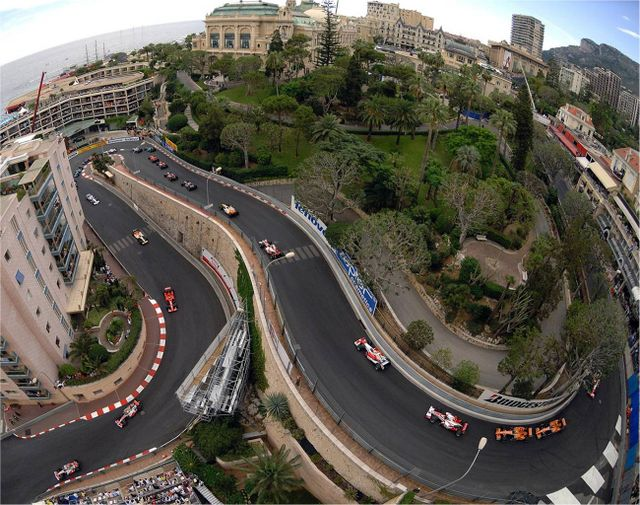
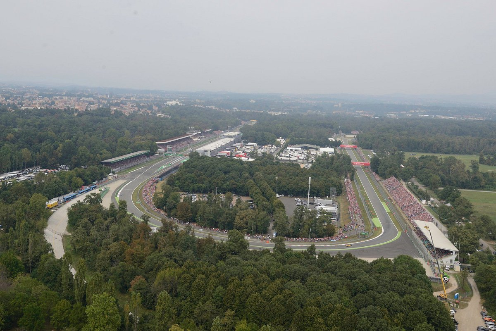

<style>
body {
  background-color: #383232;
  background-image:
    linear-gradient(45deg, #000000 25%, transparent 25%),
    linear-gradient(-45deg, #000000 25%, transparent 25%),
    linear-gradient(45deg, transparent 75%, #000000 75%),
    linear-gradient(-45deg, transparent 75%, #000000 75%);
  background-size: 20px 20px;
  background-position: 0 0, 0 10px, 10px -10px, -10px 0;
  text-align: justify;
}

#back-to-top {
  position: fixed;
  bottom: 20px;
  right: 20px;
  background-color: red;
  color: black;
  padding: 0px 20px;
  border-radius: 4px;
  display: none;
}

#back-to-top a {
  color: black;
  text-decoration: none;
}

#back-to-top a:hover {
  text-decoration: underline;
}
</style>

```{r setup, include=FALSE}
knitr::opts_chunk$set(warning=FALSE,message=FALSE,echo = FALSE, fig.align = "center")
```

# Introduction

Ce projet consiste en l'élaboration d'un tableau de bord afin de visualiser les éléments pertinents d'un jeu de données de Formule 1.

Ce travail a été réalisé dans le cadre de l'unité d'enseignement IF36 - Conception de visualisations de données, enseigné à l'Université de Technologie de Troyes.
Il a pour objectif d'appliquer les notions vu en cours sur un cas pratique. Nous avons alors eu l'occasion d'utiliser les techniques et méthodes abordées durant notre formation. 

Notre équipe est formée de :

- Antoine-Valentin Charpentier
- Marc-Arthur Kadangha
- Mathieu Le Treust
- Chloé Martin

<span id="sommaire"></span>

## Sommaire :

- [Introduction](#introduction)
  - [Sommaire](#sommaire)
  - [Quelques trucs à savoir sur la Formule 1...](#quelques-trucs-à-savoir-sur-la-formule-1)
    - [Contexte](#contexte)
    - [Les voitures](#les-voitures)
    - [Les équipes](#les-équipes)
    - [Les pilotes](#les-pilotes)
    - [Les courses](#les-courses)
    - [Les règles](#les-règles)
  - [Description du dataset](#description-du-dataset)
    - [Provenance](#provenance)
    - [Présentation des tables](#présentation-des-tables)
    - [Description des tables](#description-des-tables)
  - [Plan d'analyse](#plan-d%27analyse)
  - [Preparation du dataset](#preparation-du-dataset)
    - [Chargement du dataset](#chargement-du-dataset)
    - [Nettoyage du dataset](#nettoyage-du-dataset)
    - [Ajout d'attributs supplémentaires](#ajout-d'attributs-supplémentaires)
- [Exploration](#exploration)
  - [Circuits](#circuits)
    - [Comment sont répartis les circuits de Formule 1 dans le monde ?](#visualisation-1)
    - [Quels sont les circuits les plus pratiqués en Formule 1 ?](#visualisation-2)
    - [Y a t-il des répartition particulière des courses par mois pour des villes ?](#visualisation-3)
    - [Comment ont évolué les temps de course depuis 1950 ?](#visualisation-4)
    - [Le circuit a-t'il une influence sur le temps d’un tour ? Comment sont répartis les temps d'un tour pour chaque circuit ?](#visualisation-5)
    - [Le circuit influence-t-il les statistiques de vitesse ?](#visualisation-6)
    - [Le nombre d'accidents est-il en lien avec la vitesse de pointe sur un circuit ?](#visualisation-7) 
    - [Y a-t-il des circuits avec plus d'accidents que d'autres ?](#visualisation-8)
    - [Quelle est la proportion d'accidents parmi les différents statuts des pilotes en fin de course ?](#visualisation-9)
    - [La durée des arrêts dépend-elle du circuit ?](#visualisation-10)
  - [Constructeurs](#constructeurs)
    - [Quels constructeurs dominent le classement depuis 1950 ?](#visualisation-11)
    - [A quel point les arrêts pendant la course influent-ils sur le résultat à une compétition pour les constructeurs ?](#visualisation-12)
    - [Comment a évolué le temps d’arrêt au pit au fur et à mesure du temps en fonction de chaque constructeur ?](#visualisation-13)
    - [Etude des flux de pilotes entre les différentes écuries, un pilote vient d’une écurie pour aller dans une autre](#visualisation-14)
    - [Y-a-t-il des pilotes plus performants lorsqu'ils concourent pour certaines écuries ?](#visualisation-15)
  - [Pilotes](#pilotes)
    - [De quelles nationalités sont les pilotes ?](#visualisation-16)
    - [Qui sont les pilotes les plus performants en Formule 1 ?](#visualisation-17)
    - [La phase de qualification influence-t-elle le resultat final d'une course ?](#visualisation-18)
    - [Comment les points sont répartis parmi les pilotes ?](#visualisation-19)
- [Conclusion](#conclusion)


## Quelques trucs à savoir sur la Formule 1...

La Formule 1, également appelée F1, est un des sports les plus prestigieux et suivis au monde. Il s'agit d'une compétition de course automobile qui met en scène des voitures spécialement conçues, des équipes et des pilotes hautement compétitifs.

### Contexte
La Formule 1 est née en Europe dans les années 1950, mais elle est rapidement devenue un sport mondial avec des courses organisées sur des circuits situés aux quatre coins du globe. La F1 est réputée pour sa technologie de pointe, son glamour et ses performances exceptionnelles.

### Les voitures
Les voitures de Formule 1 sont des voitures de course extrêmement rapides et sophistiquées. Elles sont conçues pour être légères, aérodynamiques et puissantes. Les voitures sont propulsées par des moteurs à combustion interne qui génèrent une puissance de plusieurs centaines de chevaux. Elles sont équipées de pneus spéciaux, de systèmes de freinage haute performance et d'une multitude de technologies avancées.

### Les équipes
La compétition en Formule 1 se déroule entre plusieurs équipes, chacune ayant deux pilotes. Les équipes sont responsables de la conception, de la construction et de l'entretien des voitures. Elles investissent des sommes considérables dans la recherche et le développement de nouvelles technologies pour améliorer les performances de leurs voitures.

### Les pilotes
Les pilotes de Formule 1 sont des athlètes d'élite qui possèdent des compétences de conduite exceptionnelles. Ils doivent être en excellente condition physique et posséder des réflexes rapides ainsi qu'une grande maîtrise de la voiture. Les pilotes doivent également faire preuve de stratégie, de précision et de courage pour rivaliser à des vitesses extrêmement élevées.

### Les courses
La saison de Formule 1 est composée d'une série de courses appelées Grands Prix, qui se déroulent sur différents circuits du monde entier. Les pilotes s'affrontent pour remporter le championnat du monde des pilotes, tandis que les équipes se battent pour le championnat du monde des constructeurs.

### Les règles
Les règles de la Formule 1 sont complexes, mais voici quelques éléments importants :

Qualifications : Avant chaque course, les pilotes participent à des séances de qualifications pour déterminer leur position de départ sur la grille de départ. Les pilotes les plus rapides obtiennent les meilleures positions de départ.

Grille de départ : Les voitures sont alignées sur la grille de départ dans l'ordre déterminé par les qualifications. Le départ de la course se fait avec un feu rouge qui s'éteint pour indiquer le début de la course.

Pit-stops : Pendant la course, les voitures doivent s'arrêter aux stands pour changer de pneus, faire le plein de carburant et effectuer des réparations éventuelles. Les arrêts aux stands peuvent influencer le déroulement de la course.

Distribution des points : La distribution des points en Formule 1 est basée sur le classement final de chaque course. Le pilote qui termine premier marque le plus de points, généralement autour de 25, tandis que les positions suivantes reçoivent progressivement moins de points. Les points sont attribués jusqu'à la dixième place, avec une échelle décroissante. Les points marqués par les pilotes contribuent également au classement des équipes. 

## Description du dataset

### Provenance

Le dataset que nous avons choisi provient d'Ergast Developer API. L’API Ergast Developer est un service Web expérimental qui fournit un enregistrement historique des données de course automobile à des fins non commerciales. L’API fournit des données pour la série de Formule 1, depuis le début des championnats du monde en 1950. 

Vous pouvez consulter le dataset directement à partir de ce lien:
[Lien vers la dataset](https://ergast.com/mrd/db/)

Le dataset est un ensemble de 14 fichiers CSV issu d'une base de données MySQL pour un total de 19,2 Mo. Il est téléchargeable sous plusieurs formats: 
- [Tables de base de données CSV](http://ergast.com/downloads/f1db_csv.zip)
- [Images de base de données MySQL](http://ergast.com/downloads/f1db.sql.gz)

Les images de la base de données sont  mises à jour très régulièrement. Par soucis de simplicité, nous figerons le dataset à la date de début du projet (15/03/2023). 

Nous avons choisi d'analyser ce dataset sur la Formule 1 car c'est un sujet qui présente de nombreux avantages. Tout d'abord, la F1 est un sport très populaire, ce qui en fait un sujet intéressant. De plus, il s'agit d'un sport bien documenté, avec de nombreuses données collectées en permanence, ce qui facilite l'analyse et la visualisation des données. Enfin, les compétitions de F1 offrent de nombreuses possibilités d'analyse, comme l'étude des performances des équipes et des pilotes, l'impact des différentes stratégies de course et bien d'autres encore.


### Présentation des tables

Pour commencer, voici une brève liste des tables de la base de données. 

Elle contient la liste des saisons de F1, le planning des courses, leurs résultats, les résultats des qualifications et ceux des sprint. On retrouve également le classement général des conducteurs ou des constructeurs par saisons ou par course. Des tables détaillent les informations sur les conducteurs, les informations sur les constructeurs et les informations sur les circuits. L'API fournit pour ce dataset une liste de tous les codes d’état de finition afin de lister par exemple le statut d’arrivée d’un pilote spécifique dans une saison particulière. Ensuite, on retrouve une table concernant les temps au tour pour chaque conducteur et pour chaque course (données disponibles à partir de la saison 1996). Enfin, les données sur les arrêts aux stands sont disponibles pour chaque conducteur et pour chaque course à partir de la saison 2012.

|Liste des Tables      |
|---------------------:|
| circuits             |
| constructorResults   |
| constructorStandings |
| constructors         |
| driverStandings      |
| drivers              |
| lapTimes             |
| pitStops             |
| qualifying           |
| races                |
| results              | 
| seasons              |  
| status               | 

| General Notes                                                    |
|-----------------------------------------------------------------:|
| Dates, times and durations are in ISO 8601 format                |
| Dates and times are UTC                                          |
| Strings use UTF-8 encoding                                       |
| Primary keys are for internal use only                           |
| Fields ending with "Ref" are unique identifiers for external use |
| A grid position of '0' is used for starting from the pitlane     |
| Labels used in the positionText fields:                          |
|   "D" - disqualified                                             |
|   "E" - excluded                                                 |
|   "F" - failed to qualify                                        |
|   "N" - not classified                                           |
|   "R" - retired                                                  |
|   "W" - withdrew                                                 |


Les relations entre les différentes tables sont illustrées à l'aide de ce schéma entité-association et sont expliquées plus en détails dans le Guide de l’utilisateur.


Le guide de l'utilisateur peut être consulté ici :
[Lien vers le guide de l'utilisateur](https://ergast.com/docs/f1db_user_guide.txt)

Nous n'avons pas un nombre fixé d'individus dans chaque fichier csv. Voila donc une description pour chaque table. Pour chacune d'entre elles, nous nous sommes tenus d'expliciter le nombre d'individus, le nombre de variables,  leur type, et une description de chacune d'elle.

NB: Dans le cadre du projet nous serons amenés à effectuer des jointures sur les différentes tables afin d'apporter des visualitions pertinentes qui nous l'espérons permettront de répondre aux questions que nous allons détailler plus bas.


### Description des tables

Table d'origine  : **seasons** , 74 individus , 2 variables. 

Description de la table  : Cette table nous donne une liste des saisons actuellement prises en charge par l’API (1950 à 2023). L'URL réfère sur l'année et renvoie une page Wikipédia pour fournir plus d'informations.

| Variable |   Type | Description                 |
| -------: | -----: | --------------------------: |
|     year |    int | Année de la saison          |
|      url | string | Page Wikipédia de la saison |


Table d'origine  : **races** , 1102 individus , 18 variables.  

Description de la table  : Cette table nous donne les informations sur le calendrier des courses. On peut voir par exemple le calendrier des courses pour une certaine saison, ou encore le calendrier des courses effectuées par certains conducteurs.

|    Variable |   Type | Description                                   |
| ----------: | -----: | --------------------------------------------: |
|      raceId |    int | ID de la course                               |
|        year |    int | ID de la saison, relié à la table **seasons** |
|       round |    int | Numéro de course dans la saison               |
|   circuitId |    int | ID du circuit, relié à la table **circuit**   |
|        name | string | Nom de la course                              |
|        date | string | Date de la course                             |
|        time | string | Heure de départ de la course                  |
|         url | string | Page Wikipédia sur la course                  |
|    fp1_date | string | Date d'entrainement n°1                       |
|    fp1_time | string | Horaire de départ de l'entrainement n°1       |
|    fp2_date | string | Date d'entrainement n°2                       |
|    fp2_time | string | Horaire de départ de l'entrainement n°2       |
|    fp3_date | string | Date d'entrainement n°3                       |
|    fp3_time | string | Horaire  de départ de l'entrainement n°3      |
|  quali_date | string | Date des qualifications                       |
|  quali_time | string | Horaire de départ des qualifications          |
| sprint_date | string | Date du sprint                                |
| sprint_time | string | Horaire de départ du sprint                   |


Table d'origine  : **results** , 25860 individus , 18 variables. 

Description de la table  : Cette table répertorie les résultats d’une course spécifique. Si les résultats de la course spécifiée ne sont pas encore disponibles, l’élément RaceTable de la réponse sera vide.
La valeur de l’attribut position dans l’élément Result est toujours un entier, donnant l’ordre de finition de tous les pilotes. La valeur de l’attribut positionText est un entier (position de fin), « R » (retiré), « D » (disqualifié), « E » (exclu), « W » (retiré), « F » (non qualifié) ou « N » (non classé). De plus amples informations sont fournies par l’élément status. Une valeur de position sur la grille de '0' indique que le pilote a démarré de la voie des stands.

|        Variable |   Type | Description                                                |
| --------------: | -----: | ---------------------------------------------------------: |
|        resultId |    int | ID du résultat                                             |
|          raceId |    int | ID de la course, relié à la table **races**                |
|        driverId |    int | ID du pilote, relié à la table **drivers**                 |
|   constructorId |    int | ID du constructeur, relié à la table **constructors**      |
|          number |    int | Numéro du pilote                                           |
|            grid |    int | Position sur la grille de départ                           |
|        position |    int | Classement de la course                                    |
|    positionText | string | Classement de la course (format texte)                     |
|   positionOrder |    int | Classement à des fins de commande                          |
|          points |  float | Point du pilote pour la course                             |
|            laps |    int | Nombre de tour complet                                     |
|            time | string | Temps pour le 1er et l'écart avec le 1er pour les suivants |
|    milliseconds |    int | Temps du circuit en miliisecondes                          |
|      fastestLap |    int | Numéro du tour le plus rapide                              |
|            rank |    int | Classement du tour le plus rapide avec les autres pilotes  |
|  fastestLapTime | string | Durée du tour le plus rapide                               |
| fastestLapSpeed | string | Vitesse du tour le plus rapide                             |
|        statusId |    int | ID du statut du pilote, relié à la table **statuts**       |


Table d'origine  : **constructor_results** , 12180 individus , 5 variables 

Description de la table  : Cette table nous donne le résultat des constructeurs par course spécifiée.


|             Variable |  Type | Description                                          |
| -------------------: | ----: | ---------------------------------------------------: |
| constructorResultsId |   int | Id sur les résultats des constructeurs               |
|               raceId |   int | Id de la course, relié à la table **races**          |
|        constructorId |   int | Id du constructeur, relié à la table **constructor** |
|               points | float | Points obtenus par le constructeur sur la course     |
|               status |   int | "D" pour un disqualification sinon NULL              |


Table d'origine  : **sprint_results** , 120 individus , 16 variables . 

Cette table-ci nous donne des résultats des courses pour chaque conducteur avec ses performances.


|        Variable |   Type | Description                                                |
| --------------: | -----: | ---------------------------------------------------------: |
|        resultId |    int | ID du résultat du sprint                                   |
|          raceId |    int | ID de la course, relié à la table **races**                |
|        driverId |    int | ID du pilote, relié à la table **drivers**                 |
|   constructorId |    int | ID du constructeur, relié à la table **constructors**      |
|          number |    int | Numéro du pilote                                           |
|            grid |    int | Position sur la grille de départ                           |
|        position |    int | Classement officiel                                        |
|    positionText | string | Classement officiel (format texte)                         |
|   positionOrder |    int | Classement à des fins de commande                          |
|          points |  float | Point du pilote pour la course                             |
|            laps |    int | Nombre de tour complet                                     |
|            time | string | Temps pour le 1er et l'écart avec le 1er pour les suivants |
|    milliseconds |    int | Temps du circuit en miliisecondes                          |
|      fastestLap |    int | Numéro du tour le plus rapide                              |
|  fastestLapTime | string | Durée du tour le plus rapide                               |
|        statusId |    int | ID du statut du pilote, relié à la table **statuts**       |


Table d'origine  : **circuit** , 77 individus , 9 variables

C'est une table qui permet de connaître diverses informations sur les circuits de course.

|   Variable |   Type | Description                                        |
| ---------: | -----: | -------------------------------------------------: |
|  circuitId |    int | ID du circuit                                      |
| circuitRef | string | Identifiant unique du circuit (ex : "albert_park") |
|       name | string | Nom du circuit                                     |
|   location | string | Localisation du circuit                            |
|    country | string | Pays du circuit                                    |
|        lat |  float | Latitude                                           |
|        lng |  float | Longitude                                          |
|        alt | string | Altitude du circuit en mètres                      |
|        url | string | Page wikipédia du circuit                          |


Table d'origine  : **constructors** , 211 individus , 5 variables

Cette table présente les constructeurs automobiles.

|       Variable |   Type | Description                                       |
| -------------: | -----: | ------------------------------------------------: |
|  constructorId |    int | ID du constructeur                                |
| constructorRef | string | Identifiant unique du constructeur (ex : mclaren) |
|           name | string | Nom du constructeur                               |
|    nationality | string | Nationalité du constructeur                       |
|            url | string | Page Wikipédia du constructeur                    |


Table d'origine  : **constructor_standings** , 12941 individus , 7 variables.

Cette table-ci nous donne des informations sur pour chaque constructeur sur les courses qu'il a effectué.

|               Variable |               Type | Description                                             |
| ---------------------: | -----------------: | ------------------------------------------------------: |
| constructorStandingsId |                int | ID du classement constructeur                           |
|                 raceId |                int | ID de la course, relié à la table **races**             |
|          constructorId |                int | ID du constructeur, relié à la table **constructors**   |
|                 points |              float | Nombre de point du pilote sur la saison                 |
|               position |                int | Classement du constructeur sur la course                |
|           positionText |             String | Classement du constructeur sur la course (format texte) |
|                    win | int (like boolean) | Gagnant ou Perdant de la course                         |


Table d'origine  : **drivers** , 857 individus , 9 variables.

Cette table-ci nous donne des informations sur les conducteurs.

|            Variable |   Type | Description                                            |
| ------------------: | -----: | -----------------------------------------------------: |
|            driverId |    int | ID du pilote                                           |
|           driverRef | string | Identification unique du pilote (ex : "hamilton")      |
|              number | string | Numero du pilote courante (ce n'est pas le classement) |
|                code | String | Code du pilote (ex : "HAM")                            |
|            forename | String | Prénom du pilote                                       |
|             surname | String | Nom du pilote                                          |
| dob (date of birth) | string | Date de naissance du pilote                            |
|         nationality | String | Nationalité du pilote                                  |
|                 url | string | Page Wikipédia du pilote                               |


Table d'origine  : **drivers_standings** , 33902 individus , 7 variables.

Cette table-ci nous donne des informations pour chaque conducteur sur les courses qu'il a effectué.

|          Variable |          Type | Description                                 |
| ----------------: | ------------: | ------------------------------------------: |
| driverStandingsId |           int | ID du classement pilote                     |
|            raceId |           int | ID de la course, relié à la table **races** |
|          driverId |           int | ID du pilote, relié à la table **drivers**  |
|            points |         float | Nombre de points du pilote sur la saison    |
|          position |           int | Classement du pilote sur la course          |
|      positionText |        String | Classement du pilote (format texte)         |
|              wins | int (boolean) | Gagnant ou perdant de la course             |


Table d'origine  : **laps_time** , 539171 individus , 6 variables.

Cette table-ci nous donne des informations à chaque tour de course sur chaque conducteur.

|     Variable |   Type | Description                                 |
| -----------: | -----: | ------------------------------------------: |
|       raceId |    int | ID de la course, relié à la table **races** |
|     driverId |    int | ID du pilote, relié à la table **drivers**  |
|          lap |    int | Numéro du tour                              |
|     position |    int | Position du pilote                          |
|         time | string | Durée du tour                               |
| milliseconds |    int | Durée du tour en millisecondes              |


Table d'origine  : **pit_stop** , 9684 individus , 7 variables.

Cette table-ci nous donne des informations sur l'arrêt effectué par un conducteur auprès de son équipe (repos , rafraîchissement) pour chaque tour de course.

|     Variable |   Type | Description                                 |
| -----------: | -----: | ------------------------------------------: |
|       raceId |    int | ID de la course, relié à la table **races** |
|     driverId |    int | ID du pilote, relié à la table **drivers**  |
|         stop |    int | Numéro de l'arrêt                           |
|          lap |    int | Numéro de tour                              |
|         time | string | Temps auquel le driver s'arrête             |
|     duration | string | Durée de l'arrêt                            |
| milliseconds |    int | Durée de l'arrêt en millisecondes           |


Table d'origine  : **qualifying** , 9595 individus , 9 variables. 

Cette table-ci nous donne des informations pour chaque conducteur ayant participé avec leur rang . (q1,q2 et q3 sont des sessions de la course , les 15 plus rapides vont à q2 et les 10 plus rapides à q3).

|      Variable |   Type | Description                                           |
| ------------: | -----: | ----------------------------------------------------: |
|     qualifyId |    int | ID de qualification                                   |
|        raceId |    int | ID de la course, relié à la table **races**           |
|      driverId |    int | ID du pilote, relié à la table **drivers**            |
| constructorId |    int | ID du constructeur, relié à la table **constructors** |
|        number |    int | Numero du pilote                                      |
|      position |    int | Position lors des phases de qualifications            |
|            q1 | string | Meilleur temps sur un tour en q1                      |
|            q2 | string | Meilleur temps sur un tour en q2                      |
|            q3 | string | Meilleur temps sur un tour en q3                      |


Table d'origine  : **status** , 139 individus , 2 variables. 

Cette table-ci nous donne la liste des états possibles pour les conducteurs (qualifié, blessé, etc...).

| Variable |   Type | Description   |
| -------: | -----: | ------------: |
| statusId |    int | ID par statut |
|   status | string | Statut texte  |


## Plan d'analyse

Nous avons décidé d'aborder ce dataset à l'aide de la problématique générale suivante : Comment les performances des constructeurs et des pilotes de Formule 1 ont-elles évoluées au fil des années ?


Afin de répondre de manière pertinente, nous souhaitons commencer l'analyse par l'étude du circuit. Par exemple, il sera possible d'évoquer le localisation des circuit et ainsi voir si les choix de circuit ont été modifiés pour obtenir des performances plus impressionnantes. Voici un ensemble de questions concernant l'**étude du circuit** : 

- Comment sont répartis les circuits de Formule 1 dans le monde ?
- Quels sont les circuits les plus pratiqués en Formule 1 ?
- Y a t-il des répartition particulière des courses par mois pour des villes ?
- Comment ont évolué les temps de course depuis 1950 ?
- Le circuit a-t'il une influence sur le temps d’un tour ? Comment sont répartis les temps d'un tour pour chaque circuit ?
- Le circuit influence-t-il les statistiques de vitesse ?
- Le nombre d'accidents est-il en lien avec la vitesse de pointe sur un circuit ?
- Y a-t-il des circuits avec plus d'accidents que d'autres ?
- Quelle est la proportion d'accidents parmi les différents statuts des pilotes en fin de course ?
- La durée des arrêts dépend-elle du circuit ?


Par la suite, nous souhaitons réduire le champ d'étude en nous renseignant sur les constructeurs. Voici un ensemble de questions concernant l'**étude des constructeurs** :

- Quels constructeurs dominent le classement depuis 1950 ?
- A quel point les arrêts pendant la course influent-ils sur le résultat à une compétition pour les constructeurs ?
- Comment a évolué le temps d’arrêt au pit au fur et à mesure du temps en fonction de chaque constructeur ?
- Etude des flux de pilotes entre les différentes écuries, un pilote vient d’une écurie pour aller dans une autre
- Y-a-t-il des pilotes plus performants lorsqu'ils concourent pour certaines écuries ?


Enfin, nous terminerons par l'étude des pilotes et leurs performances. Voici un ensemble de questions concernant l'**étude des pilotes** :

- De quelles nationalités sont les pilotes ?
- Qui sont les pilotes les plus performants en Formule 1 ?
- La phase de qualification influence-t-elle le resultat final d'une course ?
- Comment les points sont répartis parmi les pilotes ?


```{r fonction installation}
check_and_load_package <- function(package_name) {
  # Vérifier si le package est déjà installé
  if (!require(package_name, character.only = TRUE, quietly = TRUE)) {
    # Si le package n'est pas installé, l'installer
    install.packages(package_name)
  }
  
  # Charger le package
  library(package_name, character.only = TRUE)
}
```


```{r import}
check_and_load_package("readr")
check_and_load_package("dplyr")
check_and_load_package("ggplot2")
check_and_load_package("tidyr")
check_and_load_package("tibble")
check_and_load_package("plotly")
check_and_load_package("forcats")
check_and_load_package("lubridate")
check_and_load_package("GGally")
check_and_load_package("RColorBrewer")
check_and_load_package("treemap")
check_and_load_package("sp")
check_and_load_package("mapdeck")
check_and_load_package("mapdata")
check_and_load_package("maps")
check_and_load_package("sf")
check_and_load_package("rnaturalearth")
check_and_load_package("countrycode")
```

## Preparation du dataset

### Chargement du dataset
Définition des types des colonnes lors du chargement des CSV qui ne sont pas correctement pris en compte par Readr.

ReadR émet des hypothèses sur les types de certains attributs. Cependant il n'a pas toujours raison, nous devons alors lui préciser ceux qu'il a tort :

- Certains attributs du CSV results sont considéré comme des nombres, ... Cependant, ces derniers comportent parfois des chaînes de caractères pour mentionner qu'ils ne possèdent pas la valeur, ce qui lève un warning, c'est la raison pour laquelle nous les considérons dans un premier temps comme une chaîne de caractères. Puis nous les traiterons par la suite afin de les convertir dans le type souhaité.
- Certains attributs sont considérés comme des entiers, car ils sont composés majoritairement de nombres alors que ces attributs doivent être en fin de compte des chaîne de caractères qui comporte des nombres. C'est notamment le cas de positionText pour les CSV driver_standings et constructor_standings.

```{r col_type}
column_types_results <- cols(
  position = col_character(),
  number = col_character(),
  fastestLapSpeed = col_character()
)

column_types_driver_standings <- cols(
  positionText = col_character(),
)

column_types_constructor_standings <- cols(
  positionText = col_character(),
)
```

On charge les CSV dans des dataframe

```{r loadDataset}
circuits <- read_csv("./data/circuits.csv",show_col_types = FALSE)
constructors <- read_csv("./data/constructors.csv",show_col_types = FALSE)
constructor_results <- read_csv("./data/constructor_results.csv",show_col_types = FALSE)
constructor_standings <- read_csv("./data/constructor_standings.csv", col_types = column_types_constructor_standings)
drivers <- read_csv("./data/drivers.csv",show_col_types = FALSE)
driver_standings <- read_csv("./data/driver_standings.csv", col_types = column_types_driver_standings)
# lap_times <- read_csv("./data/lap_times.csv",show_col_types = FALSE)
pit_stops <- read_csv("./data/pit_stops.csv",show_col_types = FALSE)
qualifying <- read_csv("./data/qualifying.csv",show_col_types = FALSE)
races <- read_csv("./data/races.csv",show_col_types = FALSE)
results <- read_csv("./data/results.csv", col_types = column_types_results)
seasons <- read_csv("./data/seasons.csv",show_col_types = FALSE)
status <- read_csv("./data/status.csv",show_col_types = FALSE)
# sprint_results <- read_csv("./data/sprint_results.csv",show_col_types = FALSE)
```

### Nettoyage du dataset

```{r type-results}
# modification des types
results$position <- na_if(results$position, "\\N")
results$position <- as.numeric(results$position)

results$number <- na_if(results$number, "\\N")
results$number <- as.numeric(results$number)

results$fastestLapSpeed <- na_if(results$fastestLapSpeed, "\\N")
results$fastestLapSpeed <- as.numeric(results$fastestLapSpeed)

# modification du format de l'attribut min:sec => sec
results$fastestLapTime <- sapply(results$fastestLapTime, function(x) {
  temps_split <- strsplit(x, ":", fixed = TRUE)[[1]]
  if (length(temps_split) != 2) {
    NA
  } else {
    minutes <- as.numeric(temps_split[1])
    secondes <- as.numeric(temps_split[2])
    minutes * 60 + secondes
  }
})
```

Dans le dataframe pit_stops, l'attributs duration est considéré comme une chaîne de caractères par readr, nous convertissons alors l'attribut en un nombre. A noter que certaines valeurs de ce champ sont présentées sous la forme de min:sec et d'autre sous la forme de sec. Nous convertissons donc ces durées en seconde.

```{r type-pit_stops}
# modification du format de l'attribut min:sec ou sec => sec
pit_stops$duration <- sapply(pit_stops$duration, function(x) {
  temps_split <- strsplit(x, ":", fixed = TRUE)[[1]]
  if (length(temps_split) != 2) {
    as.numeric(temps_split[1])
  } else if (length(temps_split) == 2) {
    minutes <- as.numeric(temps_split[1])
    secondes <- as.numeric(temps_split[2])
    minutes * 60 + secondes
  } else {
    NA
  }
})
```

On supprime les colonnes qui ne sont pas nécessaires à l'analyse.

```{r cleaning}
circuits <- circuits %>% select(-circuitRef, -url, -alt)
constructors <- constructors %>% select(-constructorRef,-url)
constructor_standings <- constructor_standings %>% select(-constructorStandingsId, -positionText)
drivers <- drivers %>% select(-driverRef, -number, -code, -dob,-url)
driver_standings <- driver_standings %>% select(-driverStandingsId, -positionText)
pit_stops <- pit_stops %>% select(-time)
qualifying <- qualifying %>% select(-number)
races <- races %>% select(-sprint_date, -sprint_time, -quali_date, - quali_time, -url, -time, -fp1_date, -fp2_date, -fp3_date)
results <- results %>% select(-resultId, -number, -positionText, -time, -fastestLap)
```

Pour le dataframe results, trois champs (position, number et fastestLapSpeed) doivent être des nombres, cependant dans ces derniers, des chaînes de caractères "\\N" se sont émincées, nous allons dans un premier temps les remplacer par un NA pour par la suite convertir ces attributs comme des nombres.

Par ailleurs, dans le dataframe results, l'attributs fastestLapTime désignant la durée du tour le plus rapide est une chaîne de caractère sous la forme de min:sec. Sous cette forme, cet attribut n'est pas exploitable directement pour établir des graphiques. Nous avons donc décidé de convertir cet attribut en un nombre de secondes. Nous avons alors isolé les minutes que nous avons multipliées par 60 auquel nous ajoutons le nombre de secondes renseigné dans la durée. Nous sauvegardons le résultat dans la même colonne. Lorsqu'il n'y avait pas de durée de renseigné, nous mettons la valeur NA. L'attribut prend donc le type d'un nombre.


### Ajout d'attributs supplémentaires
Pour la réalisation d'un des graphiques, il est nécessaire de connaître le mois où une course a eu lieu. Nous devons alors l'isoler de l'attribut "date" du dataframe "circuits" et le mettre dans un nouvel attribut "month".

```{r addAttributs1}
races$month <- format(races$date, "%B")
```

<br>
<hr>

# Exploration

L'exploration de ce dataset sur la Formule 1 suit trois grands axes:

- Une étude sur les circuits
- Une étude sur les pilotes
- Une étude sur les constructeurs

## Circuits

Les circuits de Formule 1 jouent un rôle crucial dans le succès de ce sport, attirant des millions de fans du monde entier pour assister aux courses en direct ou les regarder à la télévision. Ils offrent une plateforme où les meilleurs pilotes et les équipes les plus talentueuses peuvent se battre pour la victoire et se mesurer les uns aux autres dans une compétition féroce.

Que ce soit pour la vitesse, le défi technique ou le spectacle, les circuits de Formule 1 sont des éléments essentiels de l'univers de la course automobile, captivant l'imagination des amateurs de sport et laissant une empreinte durable dans l'histoire de ce sport passionnant.

### Visualisation 1

*Question*: Comment sont répartis les circuits de Formule 1 dans le monde ?

```{r visu-1, out.width = "1000px"}
circuit_year <- circuits %>%
  inner_join(races, by = "circuitId") %>%
  select(circuitId, name.x, location, country, lat, lng, year) %>%
  group_by(circuitId) %>%
  mutate(min(year)) %>%
  select(-year) %>%
  distinct(.keep_all = TRUE)

map <- plot_geo(circuit_year) %>%
  add_markers(
    x = ~lng,
    y = ~lat,
    color = "red",
    text = ~name.x,
    marker = list(color = "red")
  )
  
map <- map %>%
  layout(
    title = list(text = "Carte des circuits dans le monde", font = list(size = 16, color = "black", family = "Arial", weight = "bold"), x = 0.5),
    xaxis = list(title = "Longitude"),
    yaxis = list(title = "Latitude"),
    legend = list(title = "Variable", font = list(color = "red")),
    geo = list(
    showland = TRUE,
    landcolor = "lightgrey",
    showocean = TRUE,
    oceancolor = "#2F4F4F"
  )
)


htmltools::tags$div(
  style = "text-align: center;",
  htmltools::as.tags(ggplotly(map)))
```


> Justification de la solution

Pour introduire ce sujet, nous avons choisi de réaliser une carte.

Ce type de graphique permet d'une part de visualiser rapidement la répartition géographique des circuits de Formule 1 à travers le monde. Les points rouges représentent chaque circuit et permettent une identification visuelle immédiate de leur emplacement. Cela offre une perspective globale et permet de mettre en évidence les concentrations ou les disparités géographiques des circuits.

D'autre part, cette carte interactive permet également d'obtenir des informations supplémentaires en survolant les points avec la souris. Par exemple, en survolant un circuit, on peut afficher le nom du circuit, son pays d'origine, ainsi que d'autres détails pertinents. Cela facilite l'accès aux informations spécifiques liées à chaque circuit sans encombrer la vue globale de la carte.

En utilisant la fonctionnalité de zoom de la carte, il est possible d'explorer les détails des régions spécifiques et de faire des comparaisons visuelles entre les différentes zones géographiques. Cela peut être utile pour étudier les tendances historiques de localisation des circuits de Formule 1 et pour identifier les zones où il y a eu une forte concentration ou une expansion de l'activité.

En résumé, cette carte interactive des circuits de Formule 1 offre une représentation visuelle claire et informative de leur localisation à travers le temps. Elle permet une analyse géographique rapide, facilite l'accès aux informations spécifiques des circuits et favorise une exploration interactive des détails géographiques. Elle constitue ainsi un outil précieux pour contextualiser et appréhender la répartition spatiale des événements de Formule 1 à travers les décennies.


> Interprétation des résultats

La carte indique que la majorité des circuits se situent en Europe. On distingue également beaucoup de circuits au Japon et aux Etats-Unis. 

> Shiny App

<p align="center">

</p>
<p align="center"><i>Carte des circuits visible sur le shiny dashboard</i></p><br>


Le tableau de bord Shiny présente une carte des circuits précédents, avec une fonctionnalité supplémentaire permettant de filtrer en fonction de la date de première utilisation des circuits. Par exemple, sur la capture d'écran fournie, nous pouvons constater qu'entre 2017 et 2023, deux circuits ont été créés en Arabie saoudite. Cette nouvelle fonctionnalité offre aux utilisateurs la possibilité de visualiser l'évolution chronologique des circuits de Formule 1, en mettant en évidence les nouveaux ajouts dans différentes régions du monde.

Maintenant que chacun visualise la répartition des circuits dans le monde, on peut tout naturellement s'intéresser aux circuits les plus pratiqués.

###  Visualisation 2 

 *Question :* Quels sont les circuits les plus pratiqués en Formule 1 ? 

```{r visu-2}
top_circuit_input<-15

visu1 <- inner_join(races, circuits, by = "circuitId") %>%
  select(circuit_name = name.y) %>%
  count(circuit_name) %>%
  slice_max(n, n = top_circuit_input) %>%
    ggplot(aes(x=n, y=fct_reorder(circuit_name, n))) + 
    geom_col(fill = "red") +
    labs(x = "Nombre de courses", 
         y = "Circuits", 
         title = "Top 15 des circuits les plus pratiqués")+ 
    geom_text(aes(label = n), 
              hjust = -0.5, 
              size = 3,
              position = position_dodge(width = 1),
              inherit.aes = TRUE) +
    theme(plot.title = element_text(hjust = 0.5,face = "bold", size = 13))

visu1
```


> Justification de la solution

L'objectif de cette analyse est de déterminer les circuits qui ont accueilli le plus grand nombre de courses de Formule 1 et de mettre en évidence les circuits avec le plus d'ancienneté. Pour répondre à cette question, nous avons utilisé un graphique en barres horizontales. Ce type de graphique permet de comparer facilement les circuits en fonction du nombre de courses disputées.

Nous avons sélectionné les 15 circuits les plus fréquemment utilisés pour assurer une meilleure lisibilité des données, bien qu'il existe un total de 77 circuits répertoriés dans notre ensemble de données.

Pour créer le graphique, nous avons utilisé les informations disponibles dans la table *circuits* et dans la table *course*. On peut lire les circuits sur l'axe vertical, tandis que le nombre de courses est représenté sur l'axe horizontal. La longueur de chaque circuit est proportionnelle au nombre de courses qu'il a accueillies.


> Interprétation des résultats

Le graphique révèle les 15 circuits les plus pratiqués en Formule 1. L'autodromo Nazionale di Monza se distingue comme le circuit ayant accueilli le plus grand nombre de courses. On peut expliquer cela car Monza est l'un des circuits les plus anciens de la Formule 1, avec une longue histoire remontant aux débuts de la compétition. Depuis le tout premier Grand Prix de Formule 1 en 1950, Monza a été un lieu de rendez-vous régulier pour les épreuves de championnat. Sa longévité dans le calendrier de la Formule 1 lui a permis d'accueillir un grand nombre de courses au fil des décennies.

Cette analyse met en lumière l'héritage historique et la popularité des circuits les plus pratiqués en Formule 1, tout en fournissant des indications sur la longévité de la compétition en elle-même.


On pourrait désormais se demander à quelle fréquence et à quelle période les circuits sont pratiqués, Autrement dit, y'a-t-il un schéma qui se répète au fil des ans. C'est ce que nous avons voulu étudier dans la prochaine visualisation.

### Visualisation 3

*Question:* Y a t-il des répartitions particulières des courses par mois pour des villes ?

```{r visu-3, fig.height = 10, fig.width=9}

#top_ville_input<-20

race_circuit <- inner_join(races, circuits, by = "circuitId")%>%
  count(location ,month,name="nb_course")#%>%
  #slice_max(nb_course, n = top_ville_input)

ordre_mois <- c("janvier", "février", "mars", "avril", "mai", "juin",
                "juillet", "août", "septembre", "octobre", "novembre", "décembre")

race_circuit$month <- factor(race_circuit$month, levels = ordre_mois)

  visu20<-ggplot(race_circuit, 
                 aes(x=month,y=location,fill=nb_course)) + 
          geom_tile()+
          labs(x = "Mois", 
               y = "Villes", 
               title ="Concentration des courses par mois et par ville") +
          scale_fill_gradient(low="yellow",high="red")+
          theme(axis.text.x = element_text(angle = 45, hjust = 1), 
                plot.title = element_text(hjust = 0.5,face = "bold", size = 13))+
          guides(fill = guide_legend(title = "Nombre de courses", title.position = "top", title.theme = element_text(size = 12)))
    

visu20
```


> Justification de la solution :

Dans cette analyse, notre objectif est d'identifier s'il existe des tendances spécifiques quant à la répartition des courses dans différentes villes en fonction des mois de l'année. Pour avoir une vue d'ensemble et combiner ces deux aspects, nous avons opté pour la création d'une HeatMap. Cette visualisation représente les mois de l'année sur l'axe des abscisses et les villes sur l'axe des ordonnées.On a également encoder la concentration des courses sur un certain mois grâce à une nuance de couleurs.

La présence d'un rectangle coloré indique qu'une course a eu lieu pour la combinaison (mois; ville). Plus le rectangle est intense en couleur rouge, plus il y a eu de courses dans cette période spécifique. Il convient de noter que toutes les courses de toutes les années du jeu de données ont été prises en compte.

> Interprétation des résultats :

Les villes de Monza, Monte-Carlo et Silverstone se démarquent en tant qu'hôtes des compétitions les plus fréquentes, ce qui est en accord avec la visualisation. Certaines villes, comme Nürburg, ont accueilli des courses sur plusieurs années, ce qui indique qu'il y a eu différents types de compétitions se succédant (certains annuels, d'autres tous les 4, 5 ou 10 ans), ou que la compétition a simplement changé de mois dans certains cas.

Il est intéressant de noter que le nombre de courses en hiver est relativement faible, ce qui est cohérent avec la nécessité de bonnes conditions météorologiques pour assurer la sécurité des pilotes. La majorité des courses se concentrent entre avril et novembre, probablement en raison de conditions météorologiques plus favorables à ces moments-là.


Désormais, nous avons tous une idée globale sur les circuits de Formule 1. Nous connaissons où ils se situent, nous savons quelles sont ceux qui sont les plus pratiqués, et nous avons une idée de la période à laquelle ils sont pratiqués au fil des années. On peut alors s'intéresser à la performance des pilotes et des équipes sur les circuits, et donc analyser l'évolution des temps de course depuis 1950.

### Visualisation 4 

*Question :* Comment ont évolué les temps de course depuis 1950 ?

```{r visu-4, fig.width = 10}
# Dataframe qui recense tous les résultats de la course 14 (la plus pratiquée)
evolution_time <- inner_join(results, races, by = "raceId") %>%
  filter(circuitId == 14)%>%
    select(raceId, year, milliseconds, circuitId)%>%
      group_by(year)

evolution_time$milliseconds <- as.numeric(evolution_time$milliseconds)


#Moyenne du temps de course par année sur la course 14
evolution_time <- evolution_time %>%
  summarize(moyenne_course = mean(milliseconds, na.rm = TRUE))


#LineGraph de l'évolution du temps de course
graph_evolution_course <- evolution_time %>%
      ggplot(mapping = aes(x = year, y = moyenne_course))+
      geom_line(color = "red") +
      labs(title = "Evolution du temps de course moyen depuis 1950", 
           subtitle = "Etude réalisée sur le circuit Autodromo Nazionale di Monza", 
           x = "Année", 
           y = expression("Temps de course moyen" ~ (10^3 ~ "secondes"))) + 
      scale_y_continuous(labels = function(x) format(x/1000000, scientific = FALSE)) +
      theme(plot.title = element_text(hjust = 0.5,face = "bold", size = 13), 
            plot.subtitle = element_text(hjust = 0.5))


graph_evolution_course
```


> Justification de la solution

Le linegraph est un choix approprié pour représenter l'évolution du temps de course moyen en Formule 1 depuis 1950. Nous avons opté pour la comparaison des moyennes, car il est fréquent que des pilotes soient disqualifiés pour diverses raisons telles que des accidents. Par conséquent, les variations importantes dans les temps de course sont rares.

De plus, nous avons pris la décision de ne pas étudier les moyennes de chaque circuit par saison, car les circuits changent d'une année à l'autre. Une baisse du temps moyen pourrait être causée par un circuit plus court et donc plus rapide à parcourir, par exemple. Afin de maintenir une référence constante, nous nous sommes concentrés sur le circuit Autodromo Nazionale di Monza en Italie.

En choisissant de représenter l'évolution du temps de course moyen sur ce circuit spécifique, nous avons pu observer les tendances temporelles spécifiques à Monza et éliminer les variations dues aux différences entre les circuits d'année en année.

En résumé, nous avons privilégié le linegraph pour représenter l'évolution du temps de course moyen en Formule 1 depuis 1950. Nous avons comparé des moyennes pour prendre en compte les disqualifications, et nous nous sommes concentrés sur le circuit Autodromo Nazionale di Monza afin de maintenir une référence cohérente dans notre analyse.

> Interprétation des résultats

Ce linegraph illustre l'évolution du temps de course moyen depuis 1950 sur le circuit Autodromo Nazionale di Monza en Italie. Nous pouvons observer deux phases distinctes.

La première phase, allant de 1950 à 1980, montre une forte diminution du temps moyen de course. Cela suggère des améliorations significatives en termes de performances des voitures, des technologies et des compétences des pilotes au cours de cette période.

La deuxième phase, à partir de 1980, montre une stagnation ou une légère diminution du temps moyen de course. Cela peut indiquer un plateau dans les gains de performance ou des limites atteintes en termes d'optimisation du circuit et des véhicules.

Cependant, une observation intéressante se produit en 2020, pendant la période de la pandémie de COVID-19. On observe une nette augmentation du temps de course moyen. Il est probable que les conséquences de la pandémie, telles que les restrictions, les interruptions des entraînements et les changements dans les préparatifs, aient eu un impact sur la qualité des performances en course.

En résumé, ce linegraph met en évidence l'évolution du temps de course moyen sur le circuit de Monza en Italie. Il montre une diminution significative jusqu'en 1980, suivie d'une stagnation ou d'une légère baisse, avec une variation notable en 2020 due à l'impact de la pandémie de COVID-19 sur les performances des pilotes.


Chaque circuit a ses particularités. Nous avons voulu étudier l'influence qu'a un circuit sur le temps d'un tour.

### Visualisation 5

*Question :* Le circuit a-t'il une influence sur le temps d’un tour ? Comment sont répartis les temps d'un tour pour chaque circuit ?

```{r visu-5, fig.height = 10, fig.width=9}
q19 <- results %>% 
        left_join(races,by = join_by(raceId == raceId)) %>% 
          left_join(circuits,by = join_by(circuitId == circuitId)) %>% 
            rename(circuitName = name.y) %>%
              drop_na(fastestLapTime) %>%
                filter(fastestLapTime < 150)

mean_time <- q19 %>%
                group_by(circuitName) %>%
                  summarize(mean_time = mean(fastestLapTime, na.srm = TRUE)) %>%
                    arrange(desc(mean_time))

ggplot(q19, 
       aes(x = circuitName, y = fastestLapTime, fill = circuitName)) + 
geom_boxplot() +
labs(x = "Circuits", 
     y = "Temps d'un tour (secondes)", 
     title = "Distribution des temps de tour pour chaque circuit") +
theme(legend.position = "none",
      plot.title = element_text(hjust = 0.5,face = "bold", size = 13),
      axis.text.x = element_text(angle = 90, vjust = 0.5, hjust=1, size = 10)) +
scale_x_discrete(limits = mean_time$circuitName)
```


> Justification de la solution

Pour répondre à la question de savoir si le circuit a une influence sur le temps d'un tour, il est possible de comparer la distribution des temps d'un tour pour chaque circuit en utilisant deux types de graphiques adaptés : le graphique en violon et le graphique en boîte à moustaches.

Nous avons finalement opté pour le graphique en boîte à moustaches pour plusieurs raisons. Le diagramme en boîte à moustaches permet de visualiser les mesures de tendance centrale et de dispersion telles que la médiane, les quartiles et les valeurs aberrantes, ce qui facilite l'interprétation des caractéristiques clés de la distribution. De plus, il met en évidence les valeurs aberrantes potentielles et permet de comparer la dispersion entre les circuits. Enfin, sa présentation plus concise offre une lisibilité accrue des distributions des temps d'un tour pour chaque circuit. 

Tout d'abord, nous avons trié les circuits en fonction de leur valeur moyenne du temps d'un tour afin de faciliter la lecture et l'interprétation du graphique. En utilisant la vision pré-attentive et en exploitant l'attribut de position, nous avons pu encoder l'information quantitative de la durée d'un tour et créer une séquence visuelle qui facilite la comparaison des durées entre les circuits.

De plus, en positionnant chaque circuit sur une échelle commune, nous avons pu estimer la magnitude des différences entre les durées d'un tour pour chaque circuit. Cette échelle commune nous a permis de mieux percevoir les variations et les écarts entre les distributions de durée d'un tour, renforçant ainsi notre capacité à détecter les différences significatives entre les circuits.

> Interprétation des résultats

En regardant les médianes des temps de tours pour chaque circuit, nous pouvons voir que le circuit de Spa-Francorchamps a le temps moyen le plus élevé pour faire un tour de circuit (111 secondes), tandis que le circuit de Red Bull Ring a le temps moyen le plus faible pour faire un tour de circuit (69 secondes, soit presque deux fois moins). Cela peut s'expliquer par des facteurs tels que la longueur et la complexité du circuit et la qualité de la surface de la piste


En général, la distribution des temps de tours pour chaque circuit semble assez faible, ce qui suggère que les pilotes ont tendance à atteindre des temps de tours similaires sur chaque circuit.

En ce qui concerne l'autodromo internazionale del Mugello, celui-ci dispose d'une forte différence entre le 3ème quartile et la médian. Ceci peut s'expliquer par le fait que le circuit se situe en Italy où il fait chaud. On pourrait alors se demander si ce ne sont pas les conditions météorologiques qui influencent les performances des pilotes, les performances des pilotes peuvent varier en fonction de la période à laquel ont réalise les course (hiver de meilleurs performance qu'en été) ou si nous ne disposons pas de données abérrantes.

Cependant, des données peuvent sembler aberrantes (points noirs) pour les temps de tours. Elles sont majoritairement plus longs que plus faible. Cela pourraient être dues à des accidents ou à des circonstances imprévues qui ont ralenti les pilotes. Il est également possible que ces temps de tours plus longs soient le résultat de stratégies de course spécifiques, comme le fait de ralentir pour économiser de l'essence ou de préserver les pneus.

Enfin, pour le circuit Bahrain International Circuit, bien qu'il ait une moyenne de 95,6 secondes pour un tour de circuit, il y a plusieurs temps nettement inférieur ç cette moyenne autour de 55 secondes. Cela peut être dû à des facteurs tels que la qualité de la piste, les conditions météorologiques ou les compétences des pilotes qui sont favorable aux pilotes durant certaines périodes et d'autres moins. Les conditions météorologiques peuvent intervenir, des températures plus fraîches peuvent améliorer la performance des pneus et de la voiture, ce qui permet aux pilotes de rouler plus rapidement. De plus, une piste plus fraîche peut fournir plus d'adhérence, ce qui peut également contribuer à des temps de tours plus rapides. 

Le circuit a donc une influence significative sur le temps d'un tour en Formule 1. Les caractéristiques du circuit, telles que la longueur, la complexité et la qualité de la surface de la piste, affectent la vitesse à laquelle les pilotes peuvent rouler et influencent donc les temps de tours. Certains circuits sont plus rapides que d'autres en raison de leurs longues lignes droites, tandis que d'autres circuits plus sinueux exigent des compétences de conduite plus techniques et ralentissent les pilotes. 
Ce graphique a permit de montrer qu'il n'y a pas de réglementation spécifique sur le temps qu'un pilote de Formule 1 doit mettre pour parcourir un tour de circuit.

Puisque les temps de course sont différents dépendemment du circuit, nous pouvons évaluer les statistiques de vitesse sur chaque circuit.

### Visualisation 6

*Question :* Le circuit influence-t-il les statistiques de vitesse ?

```{r visu-6, fig.height = 10, fig.width=9}
q5 <- results %>% 
        left_join(races,by = join_by(raceId == raceId)) %>%
          left_join(circuits,by = join_by(circuitId == circuitId)) %>% 
            rename(circuitName = name.y) %>%
              drop_na(fastestLapSpeed) %>%
                  filter(fastestLapSpeed > 140) 

mean_speed <- q5 %>%
                group_by(circuitName) %>%
                  summarize(mean_speed = mean(fastestLapSpeed, na.srm = TRUE))%>%
                    arrange(desc(mean_speed)) 

ggplot(q5, aes(x = circuitName, y = fastestLapSpeed, fill = circuitName)) + 
  geom_boxplot() +
  labs(x = "Circuits", y = "Vitesse moyenne (km/h)", title = "Statistiques de vitesse moyenne par circuit") +
  theme(legend.position = "none", axis.text.x = element_text(angle = 90, vjust = 0.5, hjust=1, size = 10), plot.title = element_text(hjust = 0.5,face = "bold", size = 13)) +
  scale_x_discrete(limits = mean_speed$circuitName)

```

> Justification de la solution

Nous avons décidé d'opter pour un graphique en boîte à moustaches car il s'agit d'un outil efficace pour comparer visuellement les distributions de vitesses entre les circuits et pour identifier les différences de position centrale, de dispersion et de valeurs aberrantes. Ce type de graphique est particulièrement efficace pour une comparaison visuelle et permet de repérer facilement les caractéristiques clés d'une distribution, comme la médiane et les quartiles.Il est ainsi possible de prendre en compte des mesures de tendance centrale  (comme la médiane qui représente la valeur centrale de la distribution) et de dispersion (comme l'écart interquartile qui représente la variabilité des données). 

Pour faciliter la lecture et l'interprétation du graphique, nous avons trié les circuits en fonction de leur valeur moyenne de vitesse. Cette approche permet d'utiliser la vision pré-attentive, en exploitant l'attribut de position, pour encoder l'information quantitative de la vitesse. Ainsi, les circuits sont disposés de manière à créer une séquence visuelle qui facilite la comparaison des vitesses entre eux.

De plus, le fait que chaque circuit soit positionné sur une échelle commune nous permet d'estimer la magnitude des différences entre les vitesses des circuits. Cette échelle commune facilite la perception des variations et des écarts entre les distributions de vitesses, ce qui renforce notre capacité à détecter les différences significatives entre les circuits.

Nous avons choisi d'utiliser un graphique en boîte à moustaches plutôt qu'un graphique en barres pour plusieurs raisons comme celles de pouvoir comparer les distributions et de pouvoir mettre en valeur des dispersions qui n'auraient pas pu être visualisée, notamment important pour le circuit de l'Autofromo Internazionale del Mugello. 

> Interprétation des résultats

Le graphique représente les statistiques de vitesse moyenne par circuit pour les courses de Formule 1. On peut voir que la vitesse moyenne dépend fortement du circuit, avec des différences importantes entre les circuits les plus lents et les plus rapides. 
Monaco est le circuit le plus lent, avec une vitesse moyenne médiane d'environ 153 km/h, tandis que l'Autodromo Nazionale di Monza est le circuit le plus rapide avec une vitesse moyenne médiane d'environ 242 km/h.

La différence de vitesse moyenne entre les circuits s'explique par plusieurs facteurs. Tout d'abord, la longueur et la forme du circuit jouent un rôle important. Les circuits les plus rapides ont des lignes droites plus longues, qui permettent aux voitures d'atteindre des vitesses plus élevées, tandis que les circuits plus lents ont plus de virages serrés qui obligent les voitures à ralentir, c'est notamment le cas pour le circuit de Monaco qui comporte de nombreux virages. 

<br>

<p align="center">

</p>
<p align="center"><i>Circuit de Monaco</i></p><br>

<p align="center">

</p>
<p align="center"><i>Circuit Autodromo nazionale di Monza</i></p>


On peut également remarquer que pour certains circuits, il y a de grandes variations dans la vitesse moyenne pour un tour donné, tandis que pour d'autres, la variation est très faible. Par exemple, l'Autodromo Internazionale del Mugello a une grande différence entre le troisième quartile (environ 235km/h) et le premier quartile (environ 180km/h), ce qui signifie que la vitesse moyenne peut varier considérablement d'un tour à l'autre. Cela peut s'expliquer par la topographie du circuit et les différents types de virages, qui nécessitent des réglages différents de la voiture pour atteindre une vitesse de pointe optimale. En revanche, pour des circuits comme Miami International Autodrome, la variation de la vitesse moyenne est très faible, ce qui peut s'expliquer par un tracé plus uniforme et moins exigeant en termes de réglages pour la voiture.

Enfin, on peut noter que, en général, il n'y a pas une grande différence de vitesse moyenne entre les différents circuits de Formule 1 (majoritairement entre 200 et 225km/h). Cela peut s'expliquer par les réglementations strictes en matière de spécifications techniques des voitures, qui ont un impact sur la vitesse maximale des voitures notamment pour des raisons de sécurité [Voir réglementation des moteurs de F1](https://fr.wikipedia.org/wiki/R%C3%A9glementation_des_moteurs_de_Formule_1), ainsi que par le fait que la plupart des circuits sont conçus pour être équilibrés en termes de vitesse et de maniabilité afin de permettre des courses compétitives. Il semblerait que les circuits soit adapté pour une vitesse moyenne aux alentours de 205 km/h.


Chaque circuit amène son lot d'accidents, tous étant très spectaculaire. Les accidents de Formule 1 sont des événements tragiques qui rappellent les risques inhérents à ce sport extrême. Ils peuvent avoir des conséquences dévastatrices, tant pour les pilotes que pour les équipes. Malgré les avancées constantes en matière de sécurité, ces accidents rappellent la nécessité d'une vigilance et d'une préparation constantes pour minimiser les risques. 
Nous avons cherché à comprendre quel élément influence le nombre d'accident sur les circuits. Partant de ce principe, il nous est paru assez évident de corréler la vitesse au nombre d'accidents moyen des circuits.

### Visualisation 7

*Question:* Le nombre d'accidents est-il en lien avec la vitesse de pointe sur un circuit ? 

```{r visu-7}
#Nombre d'accidents par circuit

#jointure des tables status, results, races, et circuits + data cleaning + on filtre que les courses où il y a eu des accidents
circuit_accidents<- results %>%
                      inner_join(status,by = join_by(statusId == statusId)) %>% 
                        inner_join(races,by = join_by(raceId == raceId)) %>% 
                          inner_join(circuits,by = join_by(circuitId == circuitId)) %>%  
                            rename("circuit_name" = "name.y") %>% filter(statusId == 3)

#on ajoute une colonne qui donne la moyenne de la plus grande vitesse atteinte sur les circuits accidentés
circuit_vitesse <- circuit_accidents %>%
                     group_by(circuit_name) %>%
                       summarise(average_fastestLapSpeed = mean(fastestLapSpeed, na.rm = TRUE))

#on compte le nombre d'accident moyen par course sur chaque circuit  
circuit_moyenne_accident <- circuit_accidents %>% 
                              count(circuit_name, name = "n_accidents")

#on joint les deux tables précédentes pour obtenir la table suivant: CIRCUIT_ACCIDENTS(nom_circuit, nombre_accidents, plus_gde_vitesse_moyenne)
circuit_accidents <- circuit_vitesse %>% 
                       inner_join(circuit_moyenne_accident, by = join_by(circuit_name == circuit_name)) %>% 
                          select(circuit_name, n_accidents, average_fastestLapSpeed)

#Nombre de courses par circuit
circuit_courses <- inner_join(races, circuits, by = "circuitId") %>%
                     select(circuit_name = name.y) %>%
                       count(circuit_name,name="n_courses")
  
#Tous les circuits accidentés 
circuit_stats <- right_join(circuit_accidents, circuit_courses, by = "circuit_name") %>%
                   replace(is.na(.), 0)%>%
                     mutate(n_avg_accidents = n_accidents / n_courses)%>%   #calcul du nombre moyen d'accidents sur un circuit (nbr_accidents/nbr_course)
                       mutate(across(c('n_avg_accidents'), round, 2)) %>%   #arrondi à 2 chiffres apres la virgule n_avg_accidents
                         filter(average_fastestLapSpeed != 0)   #on retire les circuits où il y a aucune valeur pour la vitesse maximale atteinte

#scatter plot sans plotly
circuit_stats %>%
  ggplot(mapping = aes(y = n_avg_accidents, x = average_fastestLapSpeed)) +
  geom_point() +
  geom_smooth(method = "lm",color = "red") +
  scale_y_continuous(limits = c(0,4)) +
  labs(y = "Moyenne des nombres d'accidents", x = "Moyenne des vitesses maximales atteintes", title ="Corrélation entre le nombre d'accidents et la vitesse de pointe des circuits ") +
  theme(plot.title = element_text(hjust = 0.5,face = "bold", size = 13))


```


> Justification de la solution

Nous nous sommes demandés quels facteurs pouvaient influencer le nombre d'accidents sur un circuit. Il nous ait paru intéressant de voir si la vitesse était un facteur déterminant.

Le nuage de point ci-dessus nous montre la corrélation entre le nombre d'accidents et la vitesse de pointe des circuits. L'axe des abscisses représente la moyenne des vitesses maximales atteintes sur les circuits depuis 1950. L'axe des ordonnées représente quant à lui la moyenne des nombres d'accidents qui se sont produits sur les circuit depuis 1950. 

On remarque qu'il n'y a que 22 points sur le graphique, correspondant aux 28 circuits où les données concernant la vitesse de pointe sur le circuit était renseigné. 

Afin d'observer une tendance générale, nous avons afficher une régression linéaire. Cette technique d'analyse statistique permet de modéliser et d'explorer la relation linéaire entre les deux variables. La pente de la ligne de régression indique la force et la direction de la relation linéaire entre les variables. Un coefficient de régression élevé indique une relation forte, tandis qu'un coefficient proche de zéro indique une relation faible ou inexistante. La régression linéaire permet également de détecter les valeurs aberrantes qui peuvent avoir un impact significatif sur le modèle. Ces valeurs peuvent être des observations inhabituelles ou des erreurs de mesure, et leur identification peut aider à examiner et à corriger les anomalies dans les données.

> Interprétation des résultats

Interessons nous d'abord à la régression linéaire. La pente est relativement faible, ce qui indique une relation faible entre les deux valeurs. La partie gris foncé représentant la variance montre la dispersion des points autour de la ligne de régression. Nous pouvons constater que lorsque la vitesse est plus faible, la variance est plus grande.

Si on s'attarde sur les points du graphique, on remarque que la majorité des circuits où la vitesse de pointe est en dessous de 180 km/h révèle un nombre d'accidents moyen par course au dessus de 1, tandis que c'est l'opposé pour la quasi-totalité des circuits  où la vitesse de pointe dépasse 180 km/h. On peut dès à présent apporter un première réponse à la question que nous nous étions posé: ce n'est pas la vitesse qui détermine le nombre d'accidents sur un circuit. 

Essayons alors de comprendre en étudiant les circuits qui révèle le plus d'accidents quels facteurs peuvent être déterminants. 

Dans un premier temps, on identifie clairement un outlier: le circuit d'Indianapolis Motor Speedway aux Etats-Unis. La moyenne du nombre d'accidents sur ce circuit est de 3,25, tandis que la grande majorité des circuits (plus de 80%) se situent autour et en dessous de 1. Le deuxième circuit le plus accidenté est le circuit de Monaco où la moyenne du nombre d'accidents est de 1,75, c'est à dire qu'il est deux fois plus accidentés que les 3/4 des circuits. Enfin le troisième est le circuit de Nürburgring, en Allemagne. Sa moyenne du nombre d'accidents par circuit est de 1,5.

Laissons place aux explications:

**Indianapolis Motor Speedway**
Ce circuit a été pratiqué seulement entre 2000 et 2007 et 60 accidents ont été rescencés pour 19 courses. Il a été le théâtre de plusieurs accidents graves au fil des années, mais il est important de noter que la plupart de ces accidents ne sont pas spécifiquement liés à la Formule 1. Voici quelques raisons qui ont contribuées aux accidents sur ce circuit :

* Configuration de l'ovale : Le circuit d'Indianapolis Motor Speedway comprend une section ovale, qui est principalement utilisée pour les courses d'IndyCar et non pour la Formule 1. La configuration de l'ovale peut être plus exigeante en termes de vitesse et de contrôle du véhicule, ce qui peut augmenter les risques d'accidents graves.

* Différences de spécifications : La Formule 1 a des spécifications techniques différentes de celles des voitures d'IndyCar. Les voitures de Formule 1 sont conçues pour des circuits routiers et ont des caractéristiques aérodynamiques spécifiques. Lorsque la Formule 1 a été organisée à Indianapolis, des modifications ont été apportées à la configuration du circuit pour tenter de s'adapter aux spécifications des voitures de Formule 1, ce qui a pu présenter des défis supplémentaires pour les pilotes.

* Conditions météorologiques : Les conditions météorologiques peuvent jouer un rôle important dans les accidents sur n'importe quel circuit. Indianapolis Motor Speedway a connu des courses avec des conditions météorologiques difficiles, telles que des pluies torrentielles ou des températures extrêmes, qui peuvent rendre la piste plus glissante et augmenter les risques d'accidents.

**Le circuit de Monaco**
Le circuit de Monaco est unique en son genre en raison de sa nature urbaine et de son tracé étroit et sinueux qui se déroule dans les rues de la principauté de Monaco. Voici quelques raisons pour lesquelles il peut y avoir eu plusieurs accidents sur le circuit de Monaco :

* Étroitesse du circuit : Le circuit de Monaco est connu pour ses rues étroites et ses virages serrés. Cela signifie que les marges d'erreur sont minimes et qu'il est facile pour les pilotes de se retrouver trop près des murs de protection. Les pilotes doivent faire preuve d'une grande précision et d'une concentration extrême pour éviter les accidents.

* Absence de zones de dégagement : Étant donné que le circuit de Monaco est tracé dans les rues de la ville, il y a peu de zones de dégagement ou d'échappatoires. Si un pilote perd le contrôle de sa voiture, il y a de fortes chances qu'il entre en collision avec les barrières de protection, ce qui peut entraîner des accidents graves.

* Caractère technique du circuit : Le tracé de Monaco comprend de nombreux virages lents et techniques qui nécessitent une excellente maîtrise de la voiture et des compétences de conduite précises. La combinaison de virages serrés, de dénivelés et de revêtements inégaux rend le circuit particulièrement exigeant, ce qui peut augmenter les risques d'erreurs de pilotage et d'accidents.

* Pression compétitive : Le Grand Prix de Monaco est l'une des courses les plus prestigieuses de la Formule 1, et la pression pour obtenir de bons résultats peut être élevée pour les pilotes. Cette pression peut parfois pousser les pilotes à prendre des risques supplémentaires, ce qui peut conduire à des accidents.

**Nürburgring**
Le circuit du Nürburgring est réputé pour être l'un des circuits les plus exigeants et difficiles au monde. Il est composé de deux sections principales : la Nordschleife (Boucle Nord) et le circuit moderne, connu sous le nom de GP-Strecke. Il y a plusieurs raisons pour lesquelles il y a eu de nombreux accidents sur le circuit du Nürburgring :

* Longueur et complexité : La Nordschleife est un tracé extrêmement long et complexe, avec plus de 20 kilomètres de long et plus de 150 virages. Cela signifie que les pilotes doivent faire face à une variété de défis, y compris des changements d'élévation, des virages aveugles, des sections étroites et des changements fréquents de revêtement de la piste. Cette combinaison rend le circuit du Nürburgring particulièrement difficile à maîtriser, même pour les pilotes expérimentés.

* Exposition aux conditions météorologiques : En raison de sa taille et de sa configuration géographique, le circuit du Nürburgring est souvent soumis à des conditions météorologiques changeantes et imprévisibles. Les pilotes peuvent se retrouver à conduire sur une partie du circuit sous la pluie tandis que d'autres parties sont sèches, ce qui rend les conditions de conduite très difficiles et augmente les risques d'accidents.

* Faible tolérance aux erreurs : En raison de sa nature technique et de son profil sinueux, le circuit du Nürburgring offre peu de zones de dégagement et de zones de gravier pour rattraper les erreurs des pilotes. Une petite erreur de pilotage peut rapidement conduire à une sortie de piste..

Il est important de noter que la sécurité en Formule 1 a considérablement évolué au fil des ans, et de nombreuses mesures ont été prises pour améliorer la sécurité des pilotes et réduire les risques d'accidents mortels sur tous les circuits.

En conclusion, ce n'est pas la vitesse le plus grand facteur déterminant dans le nombre d'accident d'un circuit, mais plutot sa morphologie ou encore les conditions météorologiques les jours de courses. 


A la fin d'une course, chaque pilote obtient un statut spécifique. On se demande si parmi les différents circuits, il y en a qui affiche plus d'accidents que d'autres ?

### Visualisation 8

 *Question :* Y a-t-il des circuits avec plus d'accidents que d'autres ?


```{r visu-8}

top_circuit_inpu <- 15

#Nombre d'accidents par circuit
circuit_accidents <- results %>%
                      inner_join(status,by = join_by(statusId == statusId)) %>%
                        inner_join(races,by = join_by(raceId == raceId)) %>%
                          inner_join(circuits,by = join_by(circuitId == circuitId)) %>% 
                            rename("circuit_name" = "name.y") %>%
                              filter(statusId == 3) %>%
                                count(circuit_name, name = "n_accidents")
  
#Top 15 des plus accidenté
circuit_stats <- right_join(circuit_accidents, circuit_courses, by = "circuit_name") %>%
                  replace(is.na(.), 0)%>%
                    mutate(n_avg_accidents = n_accidents / n_courses)%>%
                      mutate(across(c('n_avg_accidents'), ~ round(., 2)))%>%
                        slice_max(n_avg_accidents, n = top_circuit_input)

# Visualisation des données
visu7 <- circuit_stats%>%
          ggplot(aes(y =fct_reorder(circuit_name, n_avg_accidents), x = n_avg_accidents)) +
          geom_col(fill='red') +
          labs(x = "Nombre moyen d'accidents par course", 
               y = "Circuits", 
               title = "Top 15 des circuits les plus accidentés en moyenne") +
          geom_text(aes(label = n_avg_accidents), 
                    hjust = -0.5, 
                    size = 3, 
                    position = position_dodge(width = 1), 
                    inherit.aes = TRUE) +
          theme(plot.title = element_text(hjust = 0.5,face = "bold", size = 13))
  
        
visu7

name_acc <- circuit_stats$circuit_name

visu7bis <- inner_join(races, circuits, by = "circuitId") %>%
          select(circuit_name = name.y, year) %>%
            filter(circuit_name %in% name_acc) %>%
              arrange(match(circuit_name, name_acc)) %>%
                mutate(circuit_name = reorder(circuit_name, match(circuit_name, name_acc))) %>%
                  mutate(circuit_name = fct_rev(circuit_name)) %>%
                    ggplot(aes(y = circuit_name, x = year)) +
                    geom_point(color = 'red') +
                    labs(x = "Année", 
                         y = "Circuits", 
                         title = "Utilisation des circuits au fil des années") +
                    theme(plot.title = element_text(hjust = 0.5,face = "bold", size = 13))

visu7bis


```


> Justification de la solution :

L'objectif de cette analyse est d'identifier les circuits présentant un nombre moyen d'accidents élevé, ce qui pourrait indiquer un niveau de danger plus élevé sur ces circuits. 

Pour répondre à cette question, nous avons choisi de nous concentrer sur le nombre moyen d'accidents plutôt que le nombre total d'accidents. En effet, il est important de prendre en compte la fréquence à laquelle le circuit a été pratiqué car un circuit plus ancien a généralement plus de courses et donc plus de chances de comptabiliser un nombre total d'accidents élevé. 

Nous avons utilisé un graphique en barres horizontales pour faciliter la comparaison des circuits en fonction de leur nombre moyen d'accidents. Nous avons limité l'affichage aux 15 circuits les plus dangereux pour une meilleure lisibilité.

Le second graphique quant à lui est une sorte de scatterplot. Il nous permet de savoir si des courses ont été organisé chaque année sur ces circuits très accidentés. Une absence de points implique une absence de courses.

La combinaison de ces deux diagrames sont donc complémentaires.

> Interprétation des résultats : 

Le graphique met en évidence les 15 circuits ayant le nombre moyen d'accidents le plus élevé en Formule 1. Le circuit d'Ain Dab se distingue avec un nombre moyen maximum d'accidents par course de 5. Parmi les circuits les plus pratiqués, seuls deux d'entre eux, Monaco et Nürburgring, figurent parmi les 15 circuits les plus accidentés, avec un nombre moyen d'accidents inférieur à 2. Cela souligne que le nombre de courses ne garantit pas nécessairement un niveau moyen d'accidents élevé.

Sur le second graphique, en examinant de plus près les quatre circuits en tête de liste (avec un nombre moyen d'accidents supérieur à 3), on constate qu'ils ont eu relativement peu de courses. Le circuit d'Ain Dab n'a accueilli qu'une seule course, tandis que le second circuit en a eu dix. Le circuit de Speedway a été utilisé de 1950 à 1960, puis suspendu avant d'être réutilisé à partir de 2000. Ces résultats suggèrent que la dangerosité d'un circuit très accidenté peut entraîner des mesures telles que la suspension temporaire ou définitive du circuit, ainsi que des adaptations des règles de la Formule 1.

Cette analyse met en évidence l'importance de prendre en compte le nombre moyen d'accidents plutôt que le nombre total d'accidents pour évaluer la sécurité des circuits de Formule 1. Elle souligne également l'impact que les circuits les plus accidentés peuvent avoir sur les décisions de la F1 en matière de réglementation et de sécurité.


### Visualisation 9

*Question :* Quelle est la proportion d'accidents parmi les différents statuts des pilotes en fin de course ?

```{r visu-9}

top_status_input <- 8

#Label et nombre des résultats
result_accident <- results %>%
                    inner_join(status,by = join_by(statusId == statusId)) %>%
                      count(status,sort=TRUE)

#Regrouper les autres hors  top en other
top_status <- result_accident %>%
                slice_max(n, n = top_status_input)

other <- result_accident %>% 
          anti_join(top_status, by = "n")

other_row <- tibble(status = "other", n = sum(other$n))

res_ac_pretty <- bind_rows(top_status, other_row)

visu8 <- ggplot(res_ac_pretty, 
                aes(x = 1, y = n, fill = fct_reorder(status, n))) +
         geom_bar(position = "fill", 
                  stat = "identity") +
         scale_y_continuous(labels = scales::percent_format()) +
         labs(title = "Repartition des status des pilotes en fin de course", 
              x = "",
              y = "Pourcentage") +
         geom_text(aes(label = paste0(round(n/sum(n) * 100, 1), "%")), 
                   position = position_fill(vjust = 0.5), 
                   color = "white", 
                   size = 3) +
         theme(axis.text.x=element_blank(),
               axis.ticks.x=element_blank(),
               plot.title = element_text(hjust = 0.5,face = "bold", size = 13)) +
         guides(fill = guide_legend(title = "Status", title.position = "top", title.theme = element_text(size = 12)))
        

visu8

```


> Justification de la solution :

L'objectif de cette analyse est d'évaluer la répartition globale des statuts des pilotes à la fin des courses et de déterminer la proportion d'accidents parmi ces statuts. Pour ce faire, nous avons utilisé un graphique à barres empilées (stacked bar chart). Ce type de graphique nous permet de visualiser la répartition en pourcentages des différents statuts des pilotes à la fin des courses.
Il y a 140 status possibles . Nous avons rassembler les autres dans une sections others qui se dévoilera au fur et à mesure qu'on augmentera le nombre de status à afficher sur un dashboard

> Interprétation des résultats :

Chaque section du graphique représente la proportion des pilotes ayant obtenu un statut spécifique. En observant les résultats, nous constatons que la majorité des pilotes (27,4%) terminent la course sans aucun retard par rapport au premier pilote. Les statuts "accident" représentent quant à eux 4% de l'ensemble des états des pilotes. Les autres statuts, tels que les retards de un tour (+1 lap), deux tours (+2 laps), etc., sont également représentés dans le graphique.

Cette analyse permet en évidence d'être plus éclairé pour les visualisations qui vont suivre.


La durée des arrêts au stand en Formule 1 est un facteur crucial pour le succès d'une course et constitue un véritable élément de stratégie. Les équipes s'efforcent de réduire au maximum le temps passé dans les stands pour ne pas compromettre la position des pilotes. 
Etudions la durée des arrêts au stand.


### Visualisation 10

*Question :* La durée des arrêts dépend-elle du circuit ?

```{r visu-10, fig.height = 10, fig.width=9}
q16 <- pit_stops %>%
        left_join(races,by = join_by(raceId == raceId)) %>%
          left_join(circuits,by = join_by(circuitId == circuitId)) %>%
            rename(circuitName = name.y) %>%
              drop_na(duration) %>%
                filter(duration < 45)

mean_time <- q16 %>%
                group_by(circuitName) %>%
                  summarize(mean_time = mean(duration, na.srm = TRUE)) %>%
                    arrange(desc(mean_time)) 

ggplot(q16, 
       aes(x=circuitName, y=duration, fill=circuitName)) +
geom_boxplot() +
labs(x = "Circuits", 
     y = "Temps d'arrêt (secondes)", 
     title = "Distribution de la durée des arrêts aux stands par circuit en F1") +
theme(legend.position = "none", 
      plot.title = element_text(hjust = 0.5,face = "bold", size = 13),
      axis.text.x = element_text(angle = 90, vjust = 0.5, hjust=1, size = 10)) +
scale_x_discrete(limits = mean_time$circuitName)

```


> Justification de la solution

Pour répondre à cette question, nous avons voulu comparer la distribution des temps d'arrêt pour chaque circuit. Deux types de graphiques sont adaptés pour visualiser la dépendance entre la durée des arrêts et les circuits : graphique en violon et graphique en boîte à moustaches.

Nous avons pris la décision de ne pas utiliser le diagramme en violon pour notre analyse car il ne nous apportait que peu d'informations supplémentaires après l'avoir tracé, par rapport au diagramme en boîte à moustaches pour répondre à cette question.

Le recours à un histogramme ou un density chart avait une répercussion sur la lisibilité de ces derniers du fait du nombre important de circuit.

Pour faciliter la lecture et l'interprétation du graphique, nous avons trié les circuits en fonction de leur valeur moyenne du temps d'arrêt. Cette approche permet d'utiliser la vision pré-attentive, en exploitant l'attribut de position, pour encoder l'information quantitative de la durée d'arrêt. Ainsi, les circuits sont disposés de manière à créer une séquence visuelle qui facilite la comparaison des durées d'arrêt entre eux.

De plus, le fait que chaque circuit soit positionné sur une échelle commune nous permet d'estimer la magnitude des différences entre les durées d'arrêt pour chaque circuit. Cette échelle commune facilite la perception des variations et des écarts entre les distributions de durée d'arrêt, ce qui renforce notre capacité à détecter les différences significatives entre les circuits.

> Interprétation des résultats

En observant le diagramme précédant sur la durée des arrêts aux stands par circuit, on peut observer que la durée des arrêts dépend en effet du circuit. On peut constater que les durées d'arrêt varient significativement entre les circuits. Par exemple, sur le circuit Park Zandvoort, la durée médiane d'arrêt est d'environ 20 secondes, tandis que sur le circuit de Autodromo Enzo e Dino Ferrari, elle est d'environ 30 secondes. Ces différences peuvent s'expliquer par plusieurs facteurs tels que la longueur de la ligne des stands, la configuration du circuit, la vitesse à laquelle les voitures peuvent entrer et sortir des stands, la réglementation spécifique à chaque circuit, etc.

De plus, un circuit avec une longue ligne droite peut entraîner une usure plus importante des pneus car peut aller plus vite et donc nécessiter un changement de pneus plus fréquent, augmentant ainsi la durée de l'arrêt au stand. De même, un circuit avec de nombreux virages serrés peut entraîner une usure accrue des freins, ce qui peut nécessiter un remplacement des plaquettes de frein et ainsi augmenter la durée de l'arrêt. La configuration du circuit peut également avoir un impact sur le temps nécessaire pour entrer et sortir des stands, en fonction de la longueur et de la largeur des voies d'accès et de sortie.
Ces derniers points peuvent donc expliquer les dispersions  pour :

- Le Losail International Circuit et le Sochi Autodrom sont tous deux des circuits modernes qui ont été conçus pour favoriser des courses spectaculaires et pour offrir des opportunités de dépassement. Ces circuits comportent donc des lignes droites suffisamment longues pour permettre aux voitures de prendre de la vitesse, ainsi que des virages techniques qui mettent en valeur les compétences des pilotes et de leurs équipes en termes de stratégie de course. Ces caractéristiques peuvent expliquer pourquoi les durées d'arrêt sont plus concentrées autour de la médiane sur ces circuits du fait de l'usure des pneus plus importante.

- D'un autre côté, les circuits comme le Circuit Paul Ricard et l'Autodromo Internazionale del Mugello ont des caractéristiques différentes. Par exemple, le Circuit Paul Ricard est connu pour sa ligne droite très longue, qui permet aux voitures d'atteindre des vitesses très élevées. Cependant, cela peut également signifier que les pilotes doivent freiner plus fort et plus tôt pour négocier les virages serrés, ce qui peut entraîner d'une usure accrus des freins et des penus et des différences plus marquées dans les durées d'arrêt. De même, l'Autodromo Internazionale del Mugello est un circuit très sinueux, avec de nombreux virages rapides et des dénivelés importants, ce qui peut également expliquer la plus grande dispersion des données observée sur ce circuit du fait d'une plus grande usure des freins.

Il est important pour les équipes de prendre en compte ces facteurs lorsqu'elles planifient leur stratégie d'arrêts aux stands afin d'optimiser le temps perdu et de minimiser leur impact sur le temps total de la course.


## Constructeurs

Les constructeurs jouent un rôle essentiel en Formule 1, apportant leur expertise et leur passion pour l'innovation technologique dans la compétition automobile. Ces entreprises de renommée mondiale investissent des ressources considérables dans le développement de voitures de course rapides et performantes. Leur engagement envers la Formule 1 va au-delà de la simple compétition, car ils utilisent également la plateforme pour mettre en avant leurs technologies et promouvoir leurs marques.


### Visualisation 11

*Question*: Quels constructeurs dominent le classement depuis 1950 ?

```{r visu-11}
races$date <- as.Date(races$date, format = "%Y-%m-%d")

# regrouper les dates par année et extraire la date la plus récente pour chaque année
last_dates <- aggregate(date ~ year, data = races, FUN = max) %>%
  merge(races, by = c("year", "date"))

# Sélectionner les colonnes pertinentes
last_dates <- last_dates[, c("year", "date", "raceId")]

# Renommer la colonne "raceId" en "last_race_id"
colnames(last_dates)[3] <- "last_race_id"

# On fusionne last_dates avec constructor_standings
standing_by_year <- merge(last_dates,constructor_standings, by.x = "last_race_id", by.y = "raceId") %>%
  merge(constructors, by= "constructorId") %>%
    arrange(last_race_id, desc(points)) %>%
      group_by(last_race_id) %>%
        mutate(classement = rank(desc(points)))


#création du dataframe pour le treemap
treemap_df <- standing_by_year %>%
  filter(classement == 1)%>%
    group_by(nationality, name)%>%
      tally()

standing_by_year <- standing_by_year %>%
  select(last_race_id,year, name, classement)

# Calculer la plage de valeurs pour la colonne "n"
min_n <- min(treemap_df$n)
max_n <- max(treemap_df$n)

# Calculer les tailles de police correspondantes en utilisant une transformation linéaire
min_fontsize <- 10  # Taille de police minimale
max_fontsize <- 20  # Taille de police maximale

# Calculer les tailles de police en fonction des valeurs de la colonne "n"
fontsize <- min_fontsize + (max_fontsize - min_fontsize) * (treemap_df$n - min_n) / (max_n - min_n)

#graphique Treemap
treemap(dtf = treemap_df,
                   index = c("nationality","name"),
                   vSize = "n",
                   fontsize.labels = c(13,fontsize),
                   fontcolor.labels = c("black", "white"),
                   fontface.labels = c(2,1),
                   align.labels = list(c("center","top"),c("center","center")),
                   border.col =c("black", "black"),
                   title = "Répartition des écuries et pays champions depuis 1950",
                   fontsize.title = 13
                   )

```


> Justification de la solution

Dans notre recherche pour déterminer quels constructeurs dominent le classement depuis 1950, nous avons initialement utilisé un graphique multiline avec les années en abscisse, les cinq premières places du classement en ordonnées, et chaque constructeur représenté par une couleur différente. Cependant, la multitude de constructeurs rendait le graphique illisible, ce qui nous a poussé à rechercher une meilleure solution de représentation.

Nous avons alors opté pour le treemap afin de présenter de manière optimale cette répartition. Le treemap est un graphique simple largement utilisé pour visualiser des répartitions, et il permet une analyse à plusieurs échelles, dans notre cas les écuries et les nationalités.

Le treemap, en mettant en évidence les champions de chaque année, nous permet de visualiser clairement la répartition et de tirer des conclusions sur les constructeurs dominants.

> Interprétation des résultats

Le treemap représente la répartition des écuries et des pays champions de Formule 1 depuis 1950. Parmi les 21 pays répertoriés, cinq d'entre eux (Angleterre, Italie, Allemagne, Autriche et France) sont présents dans le treemap.

On constate que les écuries anglaises dominent la Formule 1, représentant près de 50% des écuries championnes depuis 1950. Cependant, c'est l'écurie italienne Ferrari qui détient le record du nombre de victoires.

De plus, on observe qu'il y a seulement une ou deux écuries françaises, anglaises, autrichiennes et allemandes, tandis que l'Angleterre en compte onze dans ce classement.

Cet écart de domination entre les écuries anglaises et le reste du classement peut s'expliquer par une multitude de facteurs. En effet,  l'Angleterre a une longue tradition dans le sport automobile, remontant aux débuts de la Formule 1. Elle a accueilli de nombreux constructeurs et écuries, bénéficiant d'une expertise et d'un savoir-faire accumulés au fil des décennies.Mais aussi, la concentration de l'industrie automobile sur le territoire, les pilotes talenteux sont des facteurs pouvant expliquer cette domination. 

Maintenant que nous avons une idée des constructeurs qui dominent le classement, nous pouvons nous intéressé à la stratégie qu'ils mettent en place sur les courses, et notamment sur l'arrêt au stand.

### Visualisation 12

*Question*: A quel point les arrêts pendant la course influent-ils sur le résultat à une compétition pour les constructeurs?

```{r visu-12}
# On recherche la durée total d'arrêt pour chaque constructeur pour chaque course
total_duration <- pit_stops %>%
                    left_join(qualifying, by = c("raceId", "driverId")) %>%
                      select(duration, raceId, constructorId) %>%
                        group_by(raceId, constructorId) %>%
                          summarize(total_duration = sum(duration), .groups = 'drop')

# A partir des résultats des constructeurs et donc de leur position sur le podium, on les relient au temps d'arrêt total calculé précédemment
q10 <- constructor_standings %>% 
          left_join(races, by = "raceId") %>%
            left_join(total_duration, by = c("raceId", "constructorId")) %>%
              drop_na(total_duration) %>%
                arrange(position) %>%
                  filter(total_duration < 750)

q10$position <- factor(q10$position, levels = unique(q10$position))

#Violin
ggplot(q10, aes(x = position, y = total_duration, fill = position)) +
  geom_violin() +
  labs(title = "Distribution du temps d'arrêt au stop en fonction de la position d'arrivée",
       x = "Position d'arrivée",
       y = "Durée d'arrêt (secondes)") +
  theme(legend.position = "none",
        plot.title = element_text(hjust = 0.5,face = "bold", size = 13))

```

> Justification de la solution

Afin de répondre à cette question, nous avons décidé d'analyser la distribution des temps d'arrêt pour chaque position du classement des constructeurs pour effectuer une comparaison approfondie.

Pour se faire, nous avons dans un premier temps eu recours à un diagramme en boîte à moustaches pour mesurer cette distribution.

Le diagramme en boîte à moustaches fournit des informations sur la distribution des temps d'arrêt pour chaque classement. Il met en évidence la médiane, les quartiles, les valeurs extrêmes et les valeurs aberrantes éventuelles. 

Les boîtes à moustaches étant à peu près la même taille et à la même position, ce qui indique que la dispersion des données est également sensiblement la même pour toutes les positions. Il semble donc que la durée d'arrêt total ne soit pas un facteur déterminant de la performance de la voiture sur la piste.

Par la suite, nous nous sommes dirigé vers un diagramme violon pour approfondir notre analyse des distributions. 

Le diagramme violon présente la distribution des temps d'arrêt pour chaque classement sous la forme de courbes symétriques. Il permet d'ajouter une notion supplémentaire par rapport au diagramme boîte en moustache, celle de visualiser la forme de la distribution mais ne donne pas d'informations sur la moyenne, ni l'écart type qui sont donné par le diagramme boîte à moustaches. 

Quelques remarques :  
- Pour faciliter la lecture et l'interprétation du graphique, nous avons trié les durées d'arrêt en fonction du classement. Cette approche permet d'utiliser la vision pré-attentive, en exploitant l'attribut de position, pour encoder l'information ordinal qui est le classement. Ainsi, les circuits sont disposés de manière à créer une séquence visuelle qui permet de repérer plus facilement une position du classement par rapport à une autre.  
- De plus, le fait que chaque circuit soit positionné sur une échelle commune nous permet d'estimer la magnitude des différences entre les durées d'arrêt. Cette échelle commune facilite la perception des variations et des écarts entre les distributions de durée d'arrêt, ce qui renforce notre capacité à détecter les différences significatives entre les positions au classement.  

Le recours à un histogramme est moins adapté dans notre situation, car notre voulons observer les résultats sur toutes les positions, ce qui peut rendre l'histogramme illisible malgré l'encodage adapté. Par ailleurs, les histogrammes sont utilisés pour représenter des données continues, ce qui n'est pas notre cas.

> Interprétation des résultats 

Nous pouvons  voir que la densité de la distribution est à peu près la même pour toutes les positions de constructeur. Il est intéressant de noter que les distributions pour les positions de constructeur 1 à 6 ont une forme légèrement différente de celles pour les positions 7 à 12, avec des queues plus larges vers les valeurs extrêmes pour les positions plus élevées. Dans les première positions, il y a deux valeurs de densités plus élevé que le reste alors que les position plus basse ont l'air d'être plus régulier dans leur temps d'arrêt. Cela pourrait suggérer que les arrêts aux stands des constructeurs dans les positions les plus élevées sont plus sujets à des variations extrêmes dans la durée d'arrêt car plus répartis sur le temps. Alors que pour les premières position, tellement qu'ils essayent de faire vite, parfois ils font trop vite est sont amener a faire des arrêt plus long ou nécessite de faire plus de réparation car ils sont allé plus vite. Cependant, comme la densité de données est à peu près la même pour toutes les positions, cette observation doit être considérée avec prudence et ne constitue pas une conclusion définitive.

> Shiny App

<p align="center">

</p>
<p align="center"><i>Distribution du temps d'arrêt au stop visible sur le shiny dashboard</i></p><br>

Le tableau de bord Shiny présente un graphique de distribution du temps d'arrêt aux stops, avec la fonctionnalité supplémentaire de filtrage en fonction des positions d'arrivée. Par exemple, sur le screenshot fourni, nous pouvons observer la distribution du temps d'arrêt aux stops pour les positions d'arrivée allant de la 1ère à la 5ème place. Une analyse de cette distribution révèle qu'il n'existe pas réellement de relation significative entre le temps d'arrêt aux stops et la position d'arrivée des pilotes. Cela suggère que le temps d'arrêt aux stops n'est pas un facteur déterminant dans la performance finale des pilotes dans la course. Cette nouvelle fonctionnalité permet aux utilisateurs d'explorer les relations potentielles entre différentes variables et les positions d'arrivée, offrant ainsi des perspectives intéressantes sur les stratégies de course et les performances des pilotes.


### Visualisation 13

*Question:* Comment a évolué le temps d’arrêt au pit au fur et à mesure du temps en fonction de chaque constructeur ?


```{r visu-13}
#Dataframe qui recense le temps en millisecondes de tous les pit-stops connus par course.
evolution_pit_stop <- inner_join(races, pit_stops, by = "raceId") %>%
  select(raceId, year, milliseconds)%>%
    group_by(year)

evolution_pit_stop$duration <- as.numeric(evolution_pit_stop$milliseconds)

#Mediane par année du temps d'arrêt au pit-stop
evolution_pit_stop <- evolution_pit_stop %>%
  summarize(medianne_pitstop = median(milliseconds, na.rm = TRUE))

#LineGraph de l'évolution du temps d'arrêt au pit-stop
graph_evolution_pitstop <- evolution_pit_stop %>%
    ggplot(mapping = aes(x = year, y = medianne_pitstop))+
    geom_line(color = "red") +
    labs(title = "Evolution du temps médian d'arrêt depuis 2011", x = "Année", y = "Temps d'arrêt médian (en millisecondes)") + 
    theme(plot.title = element_text(hjust = 0.5,face = "bold", size = 13))


htmltools::tags$div(
  style = "text-align: center;",
  htmltools::as.tags(ggplotly(graph_evolution_pitstop)))

```


> Justification de la solution

Le linegraph est couramment utilisé pour représenter des évolutions, et dans notre étude, nous avons choisi de l'utiliser pour représenter l'évolution du temps d'arrêt médian au stand en Formule 1. Nous avons analysé l'ensemble des courses pour lesquelles nous avions les informations sur les temps d'arrêt, à partir de l'année 2011.

Pour éviter les distorsions causées par des arrêts au stand exceptionnellement longs, nous avons privilégié la médiane plutôt que la moyenne. En effet, certains arrêts peuvent être considérablement plus longs en raison de divers problèmes, ce qui ferait augmenter artificiellement la moyenne. En utilisant la médiane, nous avons pu observer le temps auquel 50% des pilotes se situent en dessous et 50% se situent au-dessus.

En résumé, nous avons utilisé le linegraph pour représenter l'évolution du temps d'arrêt médian au stand en Formule 1, en nous basant sur toutes les courses pour lesquelles nous avions les données à partir de 2011. La médiane a été privilégiée pour éviter les distorsions causées par les arrêts exceptionnellement longs, permettant ainsi de visualiser la médiane à laquelle se situent 50% des pilotes.

> Interprétation des résultats

Ce line graphique présente l'évolution du temps d'arrêt médian depuis 2011. Une tendance à la hausse du temps d'arrêt médian peut être observée au fil des années.

Le temps d'arrêt au stand en Formule 1 peut augmenter en raison de plusieurs facteurs. Tout d'abord, la complexité croissante des voitures avec l'introduction de nouvelles technologies peut rallonger les opérations d'arrêt, comme le changement de pneus ou les ajustements techniques. De plus, les règles et réglementations peuvent imposer des restrictions ou des limitations qui prolongent la durée des arrêts. La précision et la sécurité sont également des aspects essentiels, nécessitant un temps supplémentaire pour s'assurer que toutes les opérations sont effectuées correctement. Les stratégies de course peuvent également influencer la durée des arrêts, avec des équipes choisissant délibérément d'allonger le temps pour des avantages tactiques. En somme, l'augmentation du temps d'arrêt au stand en Formule 1 est une conséquence de la complexité croissante, des règles et réglementations, de la nécessité de précision et de sécurité, ainsi que des stratégies de course mises en place par les équipes.


Le flux des pilotes entre les écuries de Formule 1 est un aspect dynamique du sport qui ajoute une dimension stratégique aux équipes. Les transferts de pilotes se produisent souvent à la fin de chaque saison, offrant aux écuries l'opportunité de renforcer leur line-up. Ces mouvements sont souvent motivés par la recherche de meilleures performances, de nouveaux défis ou par des opportunités offertes par des écuries concurrentes.

### Visualisation 14

*Question:* Etude des flux de pilotes entre les différentes écuries, un pilote vient d’une écurie pour aller dans une autre

```{r visu-14.1}
#DataFrame qui contient les valeurs pour afficher la carte du monde grâce à la library "maps"
world_map <- map_data("world")


#DataFrame qui associe les nationalités et les pays
nationality <- c("American", "Austrian", "Belgian", "Brazilian", "British", "Canadian", "Dutch", "French", "German", "Hong Kong", "Indian", "Irish", "Italian", "Japanese", "Malaysian", "Mexican", "New Zealander", "Russian", "South African", "Spanish", "Swiss")

countrie <-c("United States of America", "Austria", "Belgium", "Brazil", "United Kingdom", "Canada", "Netherlands", "France", "Germany", "Hong Kong", "India", "Ireland", "Italy", "Japan", "Malaysia", "Mexico", "New Zealand", "Russia", "South Africa", "Spain", "Switzerland")

countrie_nationality <- data.frame(nationality = nationality, countrie = countrie)


# Récupération de la latitude et de la longitude des pays concernés grâce à la library "rnaturalearth"
countries <- ne_countries()
countries$longitude <- coordinates(countries)[,1]
countries$latitude <- coordinates(countries)[,2]
countrie_nationality <- countries@data %>%
  select(admin, longitude, latitude)%>%
    merge(countrie_nationality, by.x = "admin", by.y = "countrie")%>%
      rbind(c("Hong Kong", 114.177216, 22.302711, "Hong Kong"))


#DataFrame qui recense le volume de transfert entre les combinaisons de pays
transfert <- inner_join(results, races, by = "raceId")%>%
  select(driverId, constructorId, year) %>%
    distinct()%>%
      group_by(driverId, constructorId)%>%
        slice_max(year)%>%
          arrange(driverId, constructorId, year)%>%
            ungroup()%>%
              mutate(constructorNext = ifelse(driverId == lead(driverId), lead(constructorId), NA))%>%
                na.omit()%>%
                  inner_join(constructors, by ="constructorId")%>%
                    select(driverId, nationality, constructorNext, year)%>%
                      merge(constructors, by.x= "constructorNext", by.y="constructorId")%>%
                        select(nationality.x, nationality.y, year)%>%
                          group_by(nationality.x, nationality.y) %>%
                            tally()%>%
                              filter(nationality.x != nationality.y)

colnames(transfert) <- c("pays_sortant", "pays_entrant", "volume")
transfert[transfert$pays_sortant == "East German","pays_sortant"] <- "German"
transfert[transfert$pays_entrant == "East German","pays_entrant"] <- "German"
doublon = data.frame(pays_sortant = c("German"), pays_entrant = c("British"), volume = c(17))
transfert <- rbind(transfert, doublon)
transfert <- transfert[-c(36,47,48),]


#Aggrégat du volume de transfert sortant et entrant par pays
volume_par_pays_entrant <- aggregate(volume ~ pays_entrant, data = transfert, sum)
volume_par_pays_sortant <- aggregate(volume ~ pays_sortant, data = transfert, sum)


#DataFrame qui recense la balance (volume entrant - volume sortant) de tranfert par pays
balance_par_pays <- merge(volume_par_pays_entrant, volume_par_pays_sortant, by.x = "pays_entrant", by.y = "pays_sortant")%>%
  mutate(balance = volume.x - volume.y)

balance_par_pays$color <- ifelse(balance_par_pays$balance > 0, "Positive", "Negative")


#Ajout de la latitude et de la longitude du pays sortant
transfert <- countrie_nationality %>%
  merge(transfert, by.x ="nationality", by.y = "pays_sortant")%>%
    select(admin, longitude, latitude, pays_entrant, volume)

colnames(transfert) <- c("pays_sortant", "start_long", "start_lat", "pays_entrant", "volume")


#Ajout de la latitude et de la longitude du pays entrant
transfert <- countrie_nationality %>%
  merge(transfert, by.x = "nationality", by.y = "pays_entrant")%>%
    select(admin, longitude, latitude, pays_sortant, start_long, start_lat, volume)

colnames(transfert)<- c("pays_entrant", "end_long", "end_lat", "pays_sortant", "start_long", "start_lat", "volume")


#Transformation des colonnes suivantes en numerique
transfert$end_long <- as.numeric(transfert$end_long)
transfert$end_lat <- as.numeric(transfert$end_lat)
transfert$start_long <- as.numeric(transfert$start_long)
transfert$start_lat <- as.numeric(transfert$start_lat)


# ID a chaque transfert
transfert <- transfert %>%
  mutate(ID = row_number())


#Join le dataframe transfert avec lui même pour calculer le différence de volume entre une combinaison de pays et la combinaison opposée
merge_transfert <- merge(transfert, transfert, by.x = c("pays_entrant", "pays_sortant"), by.y = c("pays_sortant", "pays_entrant"))

merge_transfert$diff_volume <- merge_transfert$volume.x - merge_transfert$volume.y
merge_transfert <- merge_transfert%>%
  select(pays_entrant, end_long.x, end_lat.x, pays_sortant, start_long.x, start_lat.x, ID.x, diff_volume)

colnames(merge_transfert) <- c("pays_entrant", "end_long", "end_lat", "pays_sortant", "start_long", "start_lat", "ID", "diff_volume")


#ID des transferts qui ne possèdent pas de combinaison opposée
transfert_not_in_merge <- transfert[transfert[!(transfert$ID %in% merge_transfert$ID), "ID"],]

colnames(transfert_not_in_merge) <- c("pays_entrant", "end_long", "end_lat", "pays_sortant", "start_long", "start_lat", "diff_volume", "ID")


#Réecriture du dataframe transfert avec uniquement des transferts unidirectionnels (>2 transfert pour plus de lisibilté)
transfert <- rbind(merge_transfert, transfert_not_in_merge)%>%
  filter(diff_volume >2)


#BarGraph qui represente la balance par pays

graph_transfert <- balance_par_pays %>%
  filter(balance != 0)%>%
    ggplot(mapping = aes(x = pays_entrant, y = balance, fill = color)) +
    geom_bar(stat = "identity") +
    labs(title = "Balance de transferts par pays", 
         y = "Nombre de pilotes", 
         x = "Nationalité") +
    scale_fill_manual(values = c("Positive" = "green3", "Negative" = "red"))+
    theme(axis.text.x = element_text(angle = 45, hjust = 1), 
          plot.title = element_text(hjust = 0.5,face = "bold", size = 13)) + 
    guides(fill = guide_legend(title = "Balance", title.position = "top", title.theme = element_text(size = 12)))

graph_transfert

```


<span style="display: block; text-align: center; font-weight: bold;">Carte intéractive développée avec MAPBOX des transfert entre les pays</span>


```{r visu-14.2}
#Carte interactive avec MAPBOX
key <- 'pk.eyJ1IjoicmllbmRlbm91dmVhdSIsImEiOiJjbGg2cGljcmkwODcyM2dub3ZkYTViZWhwIn0.3EQEnEKg_nPkCXaAbh3vww'


carte_interactive <- mapdeck(token = key, 
                             style = 'mapbox://styles/mapbox/streets-v12', 
                             pitch = 45
  ) %>%
  add_animated_arc(
      data = transfert,
      layer_id = "ID",
      origin = c("start_long", "start_lat"),
      destination = c("end_long", "end_lat"),
      stroke_width = "diff_volume",
      frequency = 5,
      animation_speed = 1,
      trail_length = 3)%>%
  add_arc(
    data = transfert,
      layer_id = "ID",
      origin = c("start_long", "start_lat"),
      destination = c("end_long", "end_lat"),
      stroke_width = 2
  )

htmltools::tags$div(
  style = "text-align: center;",
  htmltools::as.tags(carte_interactive))


```


> Justification de la solution

Les graphiques utilisés permettent de répondre à la question suivante : "Existe-t-il des transferts de pilotes entre les pays, et comment sont-ils effectués ?"

Le premier graphique, un BarGraph, compare les balances de transfert entre les pays, mettant en évidence les différences dans le nombre de pilotes transférés vers et depuis chaque pays. Il permet d'observer les pays avec des balances positives et négatives, donnant ainsi une indication sur les flux de pilotes entre les nations. 

Le deuxième graphique est une carte interactive utilisant MAPBOX, qui présente les transferts entre les pays sous forme d'arcs,  en montrant les relations entre les pays en termes de volume de transferts. Les arcs animés ajoutent une dimension dynamique en illustrant les mouvements de pilotes entre les pays. L'épaisseur des arcs reflète le nombre de pilotes en transfert. Elle offre également la possibilité de se focaliser sur un pays spécifique si nécessaire.

En combinant ces deux graphiques, on obtient une vision plus complète des transferts de pilotes entre les pays en Formule 1. Le Bar graph fournit des informations quantitatives sur les balances de transfert, tandis que la carte interactive donne une représentation visuelle des relations et des flux de pilotes entre les pays.

> Interprétation des résultats

Le bar graph met en évidence que la majorité des transferts de pilotes se font en Europe. 
De plus, on observe des déséquilibres marqués entre les pays, avec par exemple l'Italie ayant perdu 60 pilotes depuis les années 1950, tandis que la France et l'Angleterre en ont accueilli respectivement 25 et 12.

La carte interactive permet de visualiser clairement que la majorité des transferts se déroulent en Europe, avec seulement une petite proportion en dehors du continent. 

En résumé, ces graphiques permettent de répondre à la question sur les transferts de pilotes entre les pays et montrent que la plupart des transferts se produisent en Europe, avec des déséquilibres significatifs entre les pays. La carte interactive offre une visualisation dynamique des transferts, mettant en évidence les flux entre les différents pays.

> Shiny App

<p align="center">

</p>
<p align="center">

</p>
<p align="center"><i>Carte interactive visible sur le shiny dashboard</i></p><br>

Le tableau de bord Shiny présente une carte interactive, avec une fonctionnalité supplémentaire permettant de filtrer les pays entrants et les pays sortants. Par exemple, sur le screenshot fourni, le pays entrant a été filtré sur l'Italie. L'application Shiny affiche alors tous les flux entrants en Italie, mettant en évidence les pays d'origine des arrivées dans ce pays spécifique. Cette fonctionnalité offre aux utilisateurs la possibilité d'explorer les flux migratoires et les relations internationales entre les différents pays, en mettant en évidence les mouvements de pilotes. Le tableau de bord Shiny permet ainsi une visualisation interactive et personnalisable des données, offrant une meilleure compréhension des dynamiques géographiques et socio-économiques.


Puisqu'il y a beaucoup de flux de pilotes entre les écuries, on s'est demandé si la performance des pilotes dépendaient des écuries pour lesqulles ils concourrent.

### Visualisation 15
*Question* Y-a-t-il des pilotes plus performants lorsqu'ils concourent pour certaines écuries ?

```{r visu-15}
driver_input<-'Michael Schumacher'

#identité ,position,constructeur par année
result_dri_const <- results %>%
                      inner_join(drivers,by = join_by(driverId == driverId)) %>%
                        inner_join(races,by = join_by(raceId == raceId)) %>%
                          inner_join(constructors,by = join_by(constructorId == constructorId)) %>%
                            rename("constructor_name"="name.y") %>%
                              unite(driver,c("forename","surname"),sep = ' ') %>%
                                select(driver,year,position,constructor_name) %>%
                                  mutate_at('position', as.numeric) %>%
                                    na.omit() %>%
                                      filter(driver==driver_input)

###Scatter plot , garder toutes les courses , 
result_dri_const %>% ggplot(aes(x=year, y=position,color=constructor_name)) + 
          geom_point() +
          geom_smooth(method = "lm") +
          labs(title =paste("Perfomances de Micheal Schumacher en fonction des constructeurs"), 
               x = "Année", 
               y = "Classement",
               fill='Constructeur') +
          theme(plot.title = element_text(hjust = 0.5,face = "bold", size = 13))+
          guides(color = guide_legend(title = "Constructeurs", title.position = "top", title.theme = element_text(size = 12)))

```


> Justification de la solution :

Notre étude vise à explorer l'effet des changements de constructeurs sur le classement des pilotes, en nous concentrant sur l'un des meilleurs pilotes de tous les temps à titre d'exemple. Nous utilisons un scatterplot pour représenter le classement annuel du pilote, en utilisant des couleurs pour indiquer les changements de constructeur. De plus, notre interface interactive sur le Shiny Dashboard permettra de filtrer et de comparer d'autres pilotes.

> Interprétation des résultats :

Initialement, nous pensions que les changements de constructeurs n'auraient pas un impact significatif, puisque le pilote reste le même. Cependant, nos résultats contredisent cette hypothèse. Pendant les quatre années passées chez Benetton, le pilote a principalement figuré parmi les meilleurs du classement. En 1996, chez Ferrari, il a maintenu de très bons résultats, avec seulement quelques rares sorties du top 10. À partir de 2007, une pause dans sa carrière semble s'être produite. En 2010, il rejoint Mercedes, où il n'a plus jamais obtenu la première place. Cette période est la plus difficile de sa carrière, avec des classements généralement compris entre la 5ème et la 15ème place.

> Shiny App

<p align="center">

</p>
<p align="center"><i>Performance de Lewis Hamilton visible sur le shiny dashboard</i></p><br>

Le tableau de bord Shiny présente les performances des pilotes en fonction des constructeurs, avec la fonctionnalité de filtrage par pilote ajoutée. Ce filtre inclut une fonctionnalité de recherche textuelle, ce qui facilite la recherche d'un pilote spécifique. Sur le screenshot fourni, on peut observer les performances de Lewis Hamilton, et il est possible d'en conclure que Hamilton a obtenu de meilleures performances lorsqu'il était chez Mercedes. Cette visualisation met en évidence la relation entre le pilote et le constructeur, soulignant l'impact de l'équipe sur les résultats des pilotes. Grâce à la recherche textuelle, les utilisateurs peuvent facilement explorer les performances d'autres pilotes de leur choix, en identifiant les constructeurs avec lesquels ils ont obtenu les meilleurs résultats. Cette fonctionnalité permet une analyse plus approfondie des performances individuelles et de la dynamique entre les pilotes et les équipes.

En conclusion, en étudiant l'un des meilleurs pilotes de l'histoire, nous constatons que les changements de constructeurs ont un impact non négligeable sur les performances du pilote. Toutefois, nous sommes conscients que d'autres facteurs peuvent également influer sur ces performances.


## Pilotes

Les pilotes de Formule 1 sont des athlètes d'élite qui repoussent les limites de la vitesse, de l'endurance et de la précision. Ils sont dotés d'un talent exceptionnel pour dompter des machines puissantes à des vitesses vertigineuses. Leurs compétences de conduite, leur capacité à prendre des décisions rapides et leur résistance physique font d'eux des protagonistes clés de ce sport exigeant.

### Visualisation 16
*Question*: De quelles nationalités sont les pilotes ?

```{r visu-16, fig.width = 10}
#Get world data
world <- ne_countries(scale = "small", returnclass = "sf")


#Data preparation
data <- drivers %>%
  mutate(countries = case_when(
    nationality == "British" ~ "United Kingdom",
    nationality == "German" ~ "Germany",
    nationality == "Spanish" ~ "Spain",
    nationality == "Finnish" ~ "Finland",
    nationality == "Japanese" ~ "Japan",
    nationality == "French" ~ "France",
    nationality == "Polish" ~ "Poland",
    nationality == "Brazilian" ~ "Brazil",
    nationality == "Portuguese" ~ "Portugal",
    nationality == "Italian" ~ "Italy",
    nationality == "Australian" ~ "Australia",
    nationality == "Austrian" ~ "Austria",
    nationality == "American" ~ "United States",
    nationality == "Dutch" ~ "Netherlands",
    nationality == "Colombian" ~ "Colombia",
    nationality == "Canadian" ~ "Canada",
    nationality == "Indian" ~ "India",
    nationality == "Hungarian" ~ "Hungary",
    nationality == "Irish" ~ "Ireland",
    nationality == "Danish" ~ "Denmark",
    nationality == "Argentine" ~ "Argentina",
    nationality == "Czech" ~ "Czech Republic",
    nationality == "Malaysian" ~ "Malaysia",
    nationality == "Swiss" ~ "Switzerland",
    nationality == "Belgian" ~ "Belgium",
    nationality == "Monegasque" ~ "Monaco",
    nationality == "Swedish" ~ "Sweden",
    nationality == "Venezuelan" ~ "Venezuela",
    nationality == "New Zealander" ~ "New Zealand",
    nationality == "Chilean" ~ "Chile",
    nationality == "Mexican" ~ "Mexico",
    nationality == "South African" ~ "South Africa",
    nationality == "Liechtensteiner" ~ "Liechtenstein",
    nationality == "Rhodesian" ~ "Rhodes",
    nationality == "American-Italian" ~ "United States,Italy",
    nationality == "Uruguayan" ~ "Uruguay",
    nationality == "Argentine-Italian" ~ "Argentina,Italy",
    nationality == "Thai" ~ "Thailand",
    nationality == "East German" ~ "Germany",
    nationality == "Russian" ~ "Russia",
    nationality == "Indonesian" ~ "Indonesia",
    nationality == "Chinese" ~ "China"
  )) %>% 
  separate_rows(countries, sep = ",") %>%
  filter(countries != "Rhodes") %>%
  group_by(countries) %>% 
  summarise(n_drivers = n()) %>% 
  arrange(desc(n_drivers)) %>% 
  mutate(countries_where_drivers = TRUE)

#add iso3 country code
#No ISO code for Rhodes
ISO_data <- data %>%
  mutate(Iso3 = countrycode::countrycode(
    sourcevar = countries,
    origin = "country.name",
    destination = "iso3c"
  ))
mid <- mean(ISO_data$n_drivers)

#Join datasets
drivers_countries <- world %>%
  select(geometry, name, adm0_a3) %>%
  left_join(ISO_data, by = c("adm0_a3" = "Iso3")) %>%
  filter(countries_where_drivers == TRUE)

#Countries in which drivers were born

map <- world %>%
  filter(admin != "Antartica") %>%
  st_transform(crs = "+proj=robin") %>%
  ggplot() +
  geom_sf(color="darkgrey") +
  geom_sf(data = drivers_countries, aes(fill = n_drivers, group = countries_where_drivers)) +
  theme_minimal() +
  theme(plot.title = element_text(hjust = 0.5,face = "bold", size = 13),
        axis.text.x = element_blank()) +
  labs(title = "Diversité de la nationalité des pilotes de Formule 1", x = NULL, y = NULL, fill = "Nombre de pilotes")+
  guides(fill = guide_legend(title = "Résultat", title.position = "top", title.theme = element_text(size = 12)))
  
map + scale_fill_gradient(low = "white", high = "red")
```


> Justification de la solution

La Formule 1 est un sport automobile de renommée mondiale qui rassemble des pilotes de différentes nationalités. Chaque saison, des pilotes talentueux issus de divers pays participent à des courses palpitantes à travers le monde, donnant lieu à une compétition internationale passionnante.

La carte ci-dessus réfere la quantité de pilotes d'une même nationalité. Cette information est encodé grâce à la nuance de couleurs de rouge appliquer sur le pays d'où vient le pilote: plus le rouge est éclatant, plus il y a de pilotes qui sont originaires de ce pays, tandis que plus le rouge est clair, moins il y a de pilotes originaires de ce pays. Ainsi on peut observer la diversité en Formule 1, et les pays dans lequel ce sport est beaucoup pratiqué

> Interprétation des résultats

La diversité des nationalités des pilotes de Formule 1 reflète la nature mondiale de ce sport et témoigne de son attrait universel. On trouve des pilotes venant de pays tels que l'Allemagne, le Royaume-Uni, la France, l'Italie, l'Espagne, le Brésil, l'Australie, les États-Unis, le Canada, la Finlande, les Pays-Bas, la Belgique, le Mexique, le Japon, la Russie, la Suède et bien d'autres.

La présence majoritaire des pilotes de Formule 1 en provenance des États-Unis et de l'Europe occidentale s'explique par plusieurs facteurs historiques, culturels et économiques :

* Histoire de la Formule 1: La Formule 1 a émergé en Europe dans les années 1950, principalement en tant que championnat automobile européen. À cette époque, la plupart des constructeurs et équipes étaient basés en Europe, ce qui a favorisé la participation des pilotes locaux. L'Europe occidentale, en particulier, a une longue tradition automobile et a été à l'avant-garde du sport automobile depuis ses débuts.

* Infrastructures et développement du sport automobile: Les pays d'Europe occidentale et les États-Unis ont investi massivement dans les infrastructures liées au sport automobile, tels que les circuits de course de renommée mondiale, les équipes, les écoles de pilotage, etc. Cela a favorisé le développement de talents locaux et a créé un vivier de pilotes compétitifs.

* Culture de la course automobile: L'Europe occidentale et les États-Unis ont une culture automobile profondément enracinée. Les courses automobiles font partie intégrante de leur histoire sportive et de leur identité nationale. Les familles et les communautés locales soutiennent souvent les jeunes talents et les encouragent à se lancer dans le sport automobile.

* Investissements et opportunités de carrière: Les pays d'Europe occidentale et les États-Unis disposent de ressources financières et d'opportunités pour les pilotes de course. Les sponsors, les équipes, les constructeurs automobiles et les programmes de développement de jeunes pilotes sont plus nombreux dans ces régions, offrant ainsi aux pilotes des opportunités de progression et de carrière.

* Accès aux compétitions de haut niveau: L'Europe occidentale et les États-Unis accueillent régulièrement des courses de haut niveau, notamment des Grands Prix de Formule 1 et d'autres compétitions automobiles prestigieuses. Cela signifie que les pilotes locaux ont plus de chances de participer à ces compétitions et de se faire remarquer par les équipes et les recruteurs.

Il est important de noter que la Formule 1 est devenue de plus en plus internationale au fil des ans, avec l'arrivée de pilotes talentueux en provenance d'autres régions du monde, tels que l'Amérique du Sud, l'Asie et l'Australie. Les facteurs mentionnés ci-dessus continuent d'influencer la répartition géographique des pilotes, mais la diversité et la mondialisation du sport se renforcent progressivement.


Maintenant qu'on a une idée sur la diversité des nationalités des pilotes, on peut dresser un TOP des pilotes les plus performants. 

### Visualisation 17 

*Question :* Qui sont les pilotes les plus performants en Formule 1 ?


```{r visu-17,fig.width = 10}

top_input=15

#Nom , et nombre de course , victoire , défaite et pourcentage de victoire
drivers_full <- driver_standings%>%
                  inner_join(drivers,by = join_by(driverId == driverId))%>%
                    inner_join(races,by = join_by(raceId == raceId))%>%
                      unite(driver,c("forename","surname"))%>%
                        group_by(driver,year) %>%
                          summarise(nb_course = n(),nb_victoire = max(wins),.groups = 'drop')%>%
                            group_by(driver) %>%
                              summarise(nb_course = sum(nb_course),nb_victoire = sum(nb_victoire),.groups = 'drop')%>%
                                mutate(pourcentage_victoire = nb_victoire / nb_course) %>%
                                  mutate(nb_lost = nb_course-nb_victoire) %>%
                                    slice_max(pourcentage_victoire, n = top_input) %>%
                                      pivot_longer(cols=c('nb_lost', 'nb_victoire'),names_to='type',values_to='value')
  

# Stackbar plot ;
drivers_full %>% ggplot(aes(x =fct_reorder(driver,pourcentage_victoire,.desc = TRUE),
                     y=value , 
                     fill=type)) +
          geom_bar(position = "stack",
                   stat="identity") +
          labs(title = "Top 15 des pilotes les plus performants", 
               subtitle = "Classé par ratio entre le nombre de victoires/défaites", 
               x = "Pilotes", 
               y = "Nombre de courses",
               fill='Résultat') +
          theme(axis.text.x = element_text(angle = 45, hjust = 1),
                plot.title = element_text(hjust = 0.5,face = "bold", size = 13), 
                plot.subtitle = element_text(hjust = 0.5)) +
          geom_text(aes(label = paste0(round(100*value/nb_course,2),'%')), 
                    position = position_stack(vjust = 0.75), 
                    size = 2) +
          scale_fill_manual(values = c('red', 'green3'),
                    labels = c('Défaites', 'Victoires'),
                    guide = guide_legend(title = "Résultat", 
                                         title.position = "top", 
                                         title.theme = element_text(size = 12)))

```

> Justification de la solution :

L'objectif de cette analyse est de déterminer les pilotes les plus performants. Plutôt que de se baser uniquement sur le nombre absolu de victoires, nous avons choisi d'utiliser le ratio victoires/nombre de courses effectuées pour évaluer l'efficacité et la performance des pilotes. Ce ratio offre une perspective intéressante sur la capacité d'un pilote à obtenir des résultats positifs de manière régulière. 

Pour représenter graphiquement ces résultats, on peut lire sur l'axe des abscisses les pilotes, et sur l'axe des ordonnées le nombre de courses disputées. Nous avons utilisé des graphiques à barres empilées (stacked bar charts), où le nombre total de courses est divisé en ratios de victoires et de défaites. 

> Interprétation des résultats :

Le graphique met en évidence les pilotes les plus performants en Formule 1. Nous retrouvons des pilotes emblématiques tels que Hamilton, Schumacher et Vettel, qui ont tous disputés un nombre considérable de courses dans l'histoire de la F1. Hamilton et Schumacher se distinguent particulièrement en approchant tous deux les 100 victoires, ce qui est remarquable de par la constance de leurs performances.

Cependant, il est important de noter que le pilote Juan Fangio occupe la première place en termes de ratio victoires/nombre de courses effectuées, démontrant ainsi sa grande performance et son efficacité sur la durée de sa carrière. Sa capacité à obtenir des victoires de manière régulière lui a permis de se positionner en tête de ce classement.


A chaque chourse, les pilotes passent une phase de qualification. 

Les qualifications sont divisées en trois catégories : Q1, Q2 et Q3. Au départ, tous les pilotes participent au Q1, dont seulement 15 sont sélectionnés pour le Q2. Parmi eux, seuls 10 accèdent au Q3. Ainsi, un pilote peut commencer la course entre la 1ère et la 10ème place sur la grille de départ s'il s'est qualifié en Q3, entre la 11ème et la 15ème place s'il s'est arrêté en Q2, et entre la 16ème et la 22ème place s'il s'est arrêté en Q1.

Maintenant que ce point est clair pour tous, voici la question que nous nous sommes posée: 

### Visualisation 18 

*Question:* La phase de qualification influence-t-elle le resultat final d'une course ?


```{r visu-18.1}

grid_position <- results %>% 
  filter(position != "NA", position < 25, grid < 25) %>% 
  group_by(position, grid) %>% 
  count %>% 
  arrange(desc(n))
mid <- mean(grid_position$n)

grid_position %>%
  ggplot(mapping = aes(x = grid, y = position, alpha = n)) +
  geom_point() +
  labs(x = "Position de départ", y = "Position d'arrivée", title ="Corrélation entre la position de départ et la position d'arrivée des pilotes")+
  theme(plot.title = element_text(hjust = 0,face = "bold", size = 13)) +
  guides(alpha = guide_legend(title = "Fréquence des combinaisons", title.position = "top", title.theme = element_text(size = 12)))

```


> Justification de la solution

Ce nuage de point nous montre la corrélation entre la position de départ des conducteurs sur une course et la position d'arrivée sur cette même course. Nous cherchons ici à mettre en évidence l'influence qu'a la position de départ sur la position d'arrivée, et donc l'intérêt de réussir les épreuves de qualifications qui est un critère déterminant pour le placement des conducteurs en début de course. 

Dans cet objectif, nous avons choisi de réaliser un nuage de point montrant en abscisse la position de départ - entre 1 et 25 - et la position d'arrivée - entre 0 et 25. 

Puisque nous affichons un point pour chaque combinaison et que chaque combinaison a été reproduite plusieurs fois, il était nécessaire de mettre en avant la fréquence de ces combinaisons afin de montrer celles qui se sont le plus reproduites depuis 1950. 

Nous avons choisi de jouer sur la transparence pour mettre en avant cela, la nuance de couleur étant moins percutante. On remarque grâce à la légende à droite du graphique que plus le point est transparent, moins la combinaison a été reproduite tandis que plus le point est opaque, plus la combinaison a été reproduite.

> Interprétation des résultats

Le graphique révèle que le plus souvent, la place attribuée au départ est celle d'arrivée, à 2-3 places près. C'est encore plus vrai pour les 5 premières positions où l'on constate une opacité plus forte. Cela s'explique surtout par le fait que l'on peut observer que peu de déplacement en Formule 1. On remarque également qu'il y a une quasi absence des points en haut du graphique (ils sont en réalité très transparent). Cela signifie que peu de conducteurs sont arrivés après la vingtième position. On pourrait expliquer cela par le fait que lors d'une course, certains facteurs implique qu'un conducteur n'est pas classé (accidents, disqualification, abandon, collision, surchauffe, et autres problèmes techniques). 

Cependant, la corrélation étant assez faible, nous ne pouvons pas apporter de certitude quant à l'analyse qui vient d'être dressé. Un autre graphique pourrait nous apporter des informations complémentaires


```{r visu-18.2}
#dataframe qui recense toutes les qualifications et le résultat de la course
qualifying_results <- inner_join(qualifying, results, by = c("raceId", "driverId", "constructorId")) %>%
  mutate(qualification = case_when(q3 != "\\N" ~ "Q3", q2 != "\\N" ~ "Q2", q1 != "\\N" ~ "Q1")) %>%
    select(qualifyId, raceId, grid,position.y, qualification)

qualifying_results$position.y <- as.numeric(qualifying_results$position.y)


#dataframe qui classe en arrivée (A1,A2,A3) et donne la fréquence pour chaque qualification (Q1,Q2,Q3)
freq_qualification_finalrange <- qualifying_results %>%
  select(position.y, qualification)%>%
    drop_na(position.y, qualification)%>%
      mutate(final_range = case_when(position.y >= 1 & position.y <= 10 ~ "A3", position.y >= 11 & position.y <= 16 ~ "A2", position.y >= 17 & position.y <= 22 ~ "A1"))%>%
        select(qualification, final_range) %>%
          group_by(qualification, final_range)%>%
            tally()%>%
              drop_na(qualification, final_range)

colnames(freq_qualification_finalrange) <- c("qualification", "final_range", "fréquence")


colnames(qualifying_results) <- c("qualifyId", "raceId", "position_depart", "position_arrivee", "qualification" )

#Parrallèle Set
graph_test <- qualifying_results %>%
  filter(qualifying_results$position_arrivee != "\\N" & qualifying_results$qualification != "" & qualifying_results$raceId == 20) %>%
    ggparcoord(
            columns = 3:4,
            groupColumn = "qualification",
            alphaLines = 1,
            showPoints = TRUE,
            scale = "globalminmax",
            title = "Relation entre la qualification et l'arrivée (Grand Prix de Barhain 2008)") + 
            ggplot2::scale_size_identity() +
            labs(x= "Grille de départ à l'arrivée", y= "Position") +
            theme(plot.title = element_text(hjust = 0.5,face = "bold", size = 13))
            

htmltools::tags$div(
  style = "text-align: center;",
  htmltools::as.tags(ggplotly(graph_test))
)
```

```{r visu-18.3}
# Diagramme en barres empilées

ggplot(freq_qualification_finalrange, aes(x = qualification, y = fréquence, fill = final_range)) +
    geom_bar(position = position_fill(),stat = "identity") +
    labs(title = "Relation entre qualification et résultat final", x = "Qualification", y = "Fréquence") +
    scale_fill_manual(values = c("red", "orange","green3"), labels = c("Entre 16eme et 22eme", "Entre 11eme et 15eme", "Entre 1er et 10eme")) +
    theme_bw() +
    theme(plot.title = element_text(hjust = 0.5,face = "bold", size = 13))+
    guides(fill = guide_legend(title = "Résultat final", title.position = "top", title.theme = element_text(size = 12)))

```

> Justification de la solution

Nous avons réalisé deux autres graphiques: un parallèle set et un stacked bar 100 %. 

Le parallèle set est basé sur le Grand Prix de Bahreïn en 2008. Il présente, en abscisse, d'une part la position de départ et d'autre part la position d'arrivée des pilotes. En ordonnée, on peut lire la position des conducteurs (de 1 à 22). On a encodé la provenance des pilotes - soit Q1, soit Q2, soit Q3 - avec trois couleurs.

Cette représentation nous permet d'observer un exemple concret de l'évolution des positions des pilotes. Cependant, nous reconnaissons que ce type de graphique n'est pas généralisable à toutes les courses de notre étude car celui-ci deviendrait illisible. 

Par conséquent,  afin de compléter notre analyse, nous avons décidé de conserver ce graphique tout en ajoutant un autre graphique. 

Les  barres empilées à 100% nous permettent de visualiser avec précision la fréquence à laquelle un pilote d'une qualification donnée (Q1, Q2, Q3) change de classement à l'arrivée en prenant en compte toutes les courses de tous les circuits. L'axe des abscisses nous montre de quelle qualification vient les pilotes, tandis que l'axe des ordonnées indique le pourcentage de pilotes qui finissent la course aux positions indiquées par la couleur.

Malgrès le fait que chaque graphique ait ses qualités et ses défauts, ils se complètent parfaitement afin de bien comprendre'avoir une meilleure compréhension de l'influence qu'a la phase de qualification sur la position finale d'une course.

> Interprétation des résultats

Ce Stacked Bar Graph 100% illustre la relation entre la qualification et le résultat final d'une course de Formule 1 depuis 1950. 

Ce graphique présente la fréquence à laquelle les qualifications (Q1, Q2, Q3) se traduisent par une position à l'arrivée. On observe que lorsqu'un pilote débute la course en Q3 (1ère à 10ème place sur la grille de départ), il a 80% de chances de terminer entre la 1ère et la 10ème place à l'arrivée. Ce pourcentage de chances chute à 45% si le pilote part du Q2 ou du Q1.

Ce graphique met en évidence l'influence de la qualification sur le résultat final de la course en Formule 1. Ainsi, cette étape est essentielle pour les pilotes, car elle joue un rôle déterminant dans leur performance globale.

Plusieurs raisons peuvent expliquer cette relation. Par exemple, les dépassements en Formule 1 peuvent être difficiles en raison de la vitesse élevée des voitures et de la nature compétitive de la course. Les pilotes qui se qualifient plus haut ont plus d'opportunités de dépasser les voitures plus lentes devant eux, tandis que ceux qui se qualifient plus bas doivent effectuer des manœuvres risquées pour remonter dans le peloton. De plus, la grille de départ peut avoir une influence phychologique sur les pilotes, peut donner une opportunité stratégique(plus le pilote est bien placé, plus la piste sera dégagée lors du départ).


Finalement, à la fin de la saison, les pilotes sont classés et des points leur sont attribués.

### Visualisation 19

*Question:* Comment les points sont répartis parmi les pilotes ?

Cette question en cache en réalité deux:

- Quelle est la répartition des points maximals que les pilotes ont eu durant une saison ?
- Quelle est la répartition des points durant les courses ?

Pour pouvoir répondre à cette double problématique, nous avons eu recours à deux graphiques distincts. Le premier traite de la première question, tandis que le deuxième traite la seconde.

Intéressons-nous d'abord à la répartition des points durant la saison : 

```{r visu-19, fig.width = 10}
# Ici, on vérifie la distribution des points maximal de chaque pilote
max_points <- aggregate(points ~ driverId, data = driver_standings, FUN = max)

max_points %>% ggplot(aes(x = points)) +
  geom_density(fill = "red", alpha = 0.5) +
  labs(x = "Nombre de points", y = "Densité de pilotes", title = "Distribution des meilleurs scores en fin de saison des pilotes de Formule 1") +
  theme(plot.title = element_text(hjust = 0.5,face = "bold", size = 13)) +
  scale_y_continuous(trans = "sqrt")

```

> Justification de la solution

Dans ce graphique nous souhaitons analyser la distribution du maximum de points que chaque pilote a déjà atteint au cours de sa carrière.

Le diagramme de densité est un outil graphique, particulièrement utile dans ce contexte. Il permet d'obtenir une représentation visuelle de la distribution des points pour chaque pilote. Contrairement à un histogramme classique qui découpe l'ensemble des données en intervalles et compte le nombre de points dans chaque intervalle, le diagramme de densité est une représentation continue qui offre une vision plus précise de la répartition des points. Il montre la probabilité relative qu'un point se situe dans une plage de valeurs donnée, ce qui permet de mieux saisir la concentration ou l'étalement des résultats.

Par ailleurs, les données présentent une forte asymétrie ou une grande étendue, une échelle linéaire conventionnelle comprimait les valeurs basses et amplifiait les valeurs élevées (vers le 0), ce qui rendait la visualisation moins informative. Pour y remédier, nous avons eu recours à une **échelle racine carrée**. Cela permet de réduire l'écart entre les valeurs élevées tout en préservant davantage les différences entre les valeurs faibles. Ainsi, les données sont mieux réparties sur l'axe, ce qui facilite la visualisation et l'interprétation des variations dans la distribution. A noter que nous n'avons pas eu recours à une échelle logarithmique car la représentation obtenue était trop extrême et rendait les différences entre les valeurs faibles encore moins perceptibles. D'autant plus que l'échelle logarithmique n'est pas appropriée pour des valeurs comprises entre 0 et 1, qui impliquait une inversion du graphique (log(x) < 0).

> Interprétation des résultats

En analysant la distribution des points des pilotes à travers le graphique précédant, on peut constater que celle-ci n'est pas uniforme et suit une distribution très inégale. En effet, la grande majorité des pilotes ont relativement peu de points, tandis qu'une poignée d'entre eux accumulent un nombre très élevé de points durant une saison. Ceci est en partie dû aux règles de la F1 qui attribuent un nombre croissant de points aux pilotes en fonction de leur position finale dans la course, avec un grand écart entre les points attribués pour les positions les plus élevées. Cette différence se creuse encore plus pour les positions suivantes, avec seulement 1 point attribué pour le 10ème place. 

Cette distribution asymétrique des points dans la F1 reflète donc la nature compétitive de la discipline, où les pilotes doivent en accumuler un grand nombre pour espérer remporter le championnat des pilotes.

De plus, il est intéressant de noter que les scores les plus élevés sont souvent obtenus par les pilotes appartenant aux équipes les plus performantes. En effet, les équipes de pointe ont souvent des voitures plus rapides et des budgets plus importants, ce qui leur donne un avantage compétitif sur les équipes moins bien financées. Cela peut être reflété dans la distribution des points où l'on observe souvent une concentration de scores élevés chez les pilotes appartenant aux équipes les plus performantes.


Qu'en est-il de la distribution des points pour chaque course ? 

```{r visu-13-2, fig.width = 10}

ggplot(results, aes(x = points, y = after_stat(count))) +
  geom_histogram(bins = 50, fill = "steelblue", color = "black", position = "identity") +
  labs(x = "Nombre de points",
       y = "Nombre de pilotes",
       title = "Répartition des points gagnés par les pilotes à la fin des courses") +
  scale_y_continuous(trans = "sqrt") +
  stat_bin(bins = 50, geom = "text", aes(label = after_stat(count)),
            size = 3, color = "black", angle = 90, hjust=-0.25) +
  theme(plot.title = element_text(hjust = 0.5, face = "bold", size = 13))


```

> Justification de la solution

Nous avons utilisé un histogramme pour représenter la distribution des points à la fin d'une course. Contrairement à un diagramme de densité, qui est plus adapté aux données continues, nous avons opté pour un histogramme car les données des points sont discrètes. Un histogramme divise l'ensemble des données en intervalles et compte le nombre de points dans chaque intervalle, ce qui permet de visualiser la répartition des points de manière appropriée dans ce contexte.

Comme pour le graphique précédant et pour les mêmes raisons, nous avons eu recours à une échelle racine carré. D'autant plus que l'échelle logarithmique n'est pas adapté lorsque nous avons des valeurs de 1, ceux-ci sont caché sur par l'axe des abscisse.

> Interprétation des résultats

Le graphique de distribution des points indique qu'il y a une nette majorité de pilotes qui n'ont reçu de points lors des courses car ils n'ont pas obtenus une assez bonne places sur le podium.

On peut remarquer également le nombre d'attribution de points compris entre 1 et 6 est assez similaire, tout comme le nombre de distribution de point entre 8 et 10. Entre 12 et 20, les distributions semblent également assez similaires. Cela peut s'expliquer par les points sont attribué à un nombre définit à l'avance de pilotes. 

En outre, il est intéressant de noter que certains pilotes ont reçu des points qui ne respectent pas la législation, avec des valeurs supérieur aux valeurs de la législation avec notamment des points de 50, 36 et 30 points. On pourrait alors pensser dans un premier temps que se sont des valeurs abérante ou des erreurs de saisie. Cependant, cela correspond à une situation exceptionnelle où les règles ont été modifiées pour une course particulière. Lors de la dernière manche du championat de 2014, à Abou Dabi, l'attribution des points a été doublée ce qui explique d'avoir une personne avec 50 (2*25), 36 (2*18), 30 (2*15). Ces valeurs correspondent au doubles de la législation qui a était mis en place en 2010. Cependant, cette expérience pour de nouvel attribution de points a été très mal prit par la communauté de la F1 et n'a duré qu'un ans. Ce dernier point explique pourquoi il n'y a pas eu d'autre pilotes ayant gagné autant de point.

Par ailleurs, on constate que la densité des grande nombre de points attribués (20 à 25) sont plus faible que les autres. Ceci peut s'expliquer d'un point de vue de la législation de la F1 qui ont désidé de récompensser davantage les première place à partir de seulement 2010, avant le maximum n'était que de 10 points pour la première place.  

A noter que la législation sur l'attribution des points à évoluée au cours des années : 

- Avant 1950, il n'y avait pas de système de points standardisé en Formule 1. C'était plutôt un système de victoire basé sur le nombre de tours menés ou sur la position d'arrivée.  

- De 1950 à 1959, les points étaient attribués aux six premiers de chaque course avec la répartition suivante : 8 points pour le premier, 6 points pour le deuxième, 4 points pour le troisième, 3 points pour le quatrième, 2 points pour le cinquième et 1 point pour le sixième.

- De 1960 à 2002, les points étaient attribués aux six premiers de chaque course avec la répartition suivante : 9 points pour le premier, 6 points pour le deuxième, 4 points pour le troisième, 3 points pour le quatrième, 2 points pour le cinquième et 1 point pour le sixième.  

- De 2003 à 2009, les points étaient attribués aux huit premiers de chaque course avec la répartition suivante : 10 points pour le premier, 8 points pour le deuxième, 6 points pour le troisième, 5 points pour le quatrième, 4 points pour le cinquième, 3 points pour le sixième, 2 points pour le septième et 1 point pour le huitième. 

- Depuis 2010 , les points étaient attribués aux dix premiers de chaque course avec la répartition suivante : 25 points pour le premier, 18 points pour le deuxième, 15 points pour le troisième, 12 points pour le quatrième, 10 points pour le cinquième, 8 points pour le sixième, 6 points pour le septième, 4 points pour le huitième, 2 points pour le neuvième et 1 point pour le dixième.

<br>
<hr>

# Conclusion 

Notre projet consistait à analyser les données de la Formule 1 depuis 1950 afin de découvrir des informations intéressantes et d'obtenir des aperçus sur l'évolution de ce sport emblématique. Pour cela, nous avons utilisé un rapport .rmd qui a permis de combiner du code, des visualisations et des explications pour présenter nos résultats.

Au cours de notre analyse, nous avons pu apprendre plusieurs éléments clés sur le jeu de données de la Formule 1. Tout d'abord, nous avons identifié les pilotes et les écuries les plus titrés, mettant en évidence les légendes du sport telles que Michael Schumacher, Lewis Hamilton et Ferrari. Nous avons également examiné les tendances de performance des équipes au fil des ans, les circuits les plus populaires et les pays les plus représentés dans la compétition. Ces découvertes ont permis de mieux comprendre l'histoire de la Formule 1 et son impact dans le monde du sport automobile.

Cependant, notre analyse a également révélé certaines difficultés. Nous avons constaté des lacunes dans les données, en particulier pour les premières décennies, où les enregistrements étaient parfois incomplets ou manquants. Cela a posé des défis pour une analyse approfondie de l'évolution des performances et des résultats. De plus, l'analyse des données historiques a été confrontée à des défis de comparabilité en raison des changements de réglementation, des différences dans les voitures et des évolutions technologiques au fil du temps. Malgré ces obstacles, nous avons pu surmonter certaines de ces difficultés en utilisant des techniques de nettoyage et d'imputation des données manquantes.

Pour étendre et élargir ce travail, plusieurs pistes s'offrent à nous. Tout d'abord, il aurait été intérréssant de croiser notre dataset avec des données externe à la Formule 1. Si elles sont correctement choisies, cette couche de données supplémentaires nous aurait permis de nous éclaircir sur certaines intérrogations persistances (Par exemple, pourquoi en 2020, le temps de course moyen a-t-il reculer au niveau du temps de course des années 1960?). De plus, il aurait été intérréssant d'explorer plus en détail les facteurs qui ont contribué au succès ou à l'échec des équipes et des pilotes. Cela pourrait inclure l'analyse des performances des pneus, des stratégies de course, des conditions météorologiques et d'autres variables pertinentes.


***Antoine-Valentin***  : "Ce projet m'a permis de développer diverses compétences, tant sur le plan technique (R, Shiny, etc..) que sur le plan conceptuel en selectionnant les graphiques les plus appropriés pour résoudre une problématique, tout en tenant compte de leur impact sur une potientielle prise de décision. J'aurais apprécié manipuler davantage les outils de BI tout au long du semestre, en testant notament plusieurs pour pouvoir les comparer."

***Marc-Arthur*** : "L'UE permet de vraiment découvrir les concepts pour la création de visualisations  pertinentes et compréhensibles. Elle donne les éléments nécéssaires à une approche d'exploration. J'ai beaucoup apprécié la découverte de Shiny dashboard. Il aurait été plus intéressant de développer beaucoup plus l'utilisation d'un outil BI (sur environ 2-3 séances ou en parallèle de l'utilisation de R)."

***Mathieu*** : "Ce projet a été une expérience enrichissante et mémorable. Il m'a donné l'opportunité de mener un projet data dans son ensemble et d'acquérir de nouvelles compétences techniques. Étant intéressé par le domaine de la business intelligence, cette unité m'a permis d'élargir mes connaissances en visualisation de données. Cependant, à mon avis, ce projet aurait pu être encore plus complet si nous avions eu le temps d'utiliser des algorithmes de Machine Learning appliquées à la datavisualisation. Cela aurait offert une perspective supplémentaire et des outils supplémentaires pour analyser et interpréter les données de manière plus approfondie."

***Chloé***: "IF36 a été une UE enrichissante et intéressante. Le projet réalisée en groupe de quatre personnes a été une réussite ; nous sommes rentrer en cohésion assez facilement et tout s'est déroulé très naturellement, avec une implication équitable de chaque membre. En outre, ce projet constitue un véritable apport pour mon projet professionnel. Il pourra facilement être valoriser via GitHub." 


<div id="back-to-top">
  <a href="#sommaire">Retour au sommaire</a>
</div>

<script>
$(document).ready(function() {
  $(window).scroll(function() {
    if ($(this).scrollTop() > 100) {
      $('#back-to-top').fadeIn();
    } else {
      $('#back-to-top').fadeOut();
    }
  });

  $('#back-to-top').click(function() {
    $('html, body').animate({scrollTop : 0}, 800);
    return false;
  });
});
</script>

